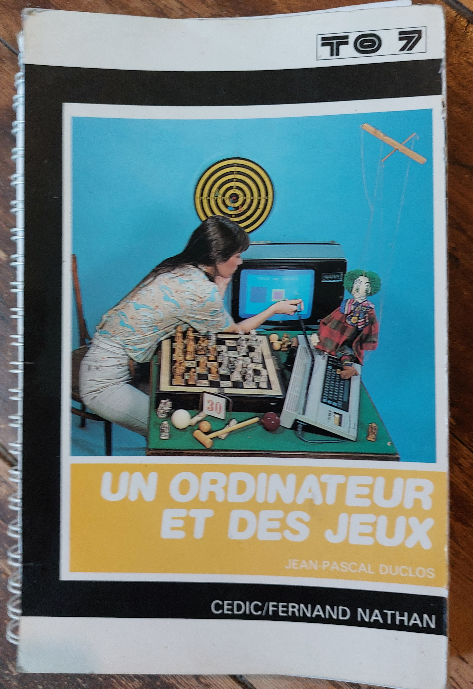
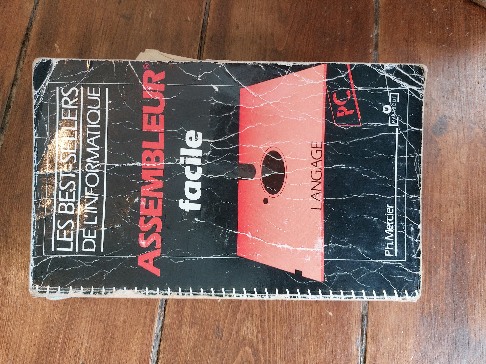

## Du Goto au Jump

À l’aube de la programmation, tout était question d’enchaînements directs : les instructions de saut, les  `JUMP` et `GOTO`, régnaient en maîtres.

Cela pourrait être le début d'un conte de "tech-fantaisie" 😄. Alors, à qui cette petite madeleine nommée JUMP ne réveille-t-elle pas des souvenirs de nuits passées à compter sur les doigts le nombre de cycles de son programme assembleur en mangeant des spaghettis ? Seulement aux plus vieux d’entre nous ? Mais qu’apprennent les jeunes ? Du Python ? Ou à se servir d’une IA générant du Python ? 😄
Bien entendu, en 1990, les langages structurés et objets existaient depuis longtemps, ce qui n’empêche qu’il était très formateur d’apprendre l’assembleur, langage compilé à partir d’instructions très simples mais "lisibles", stockées aussi dans un fichier texte. Quoi de mieux que de comprendre les registres, d’organiser la mémoire, de programmer avec les interruptions, de maîtriser les instructions élémentaires des 8086, puis 80286, jusqu’au Pentium, permettant les calculs binaires, les branchements, les conditions, et même les boucles via ce fameux Jump, pour sentir les fondements de l’architecture des ordinateurs ?

Avec un peu d’organisation, des Jump bien placés, on réinventait même ce que générait le compilateur C pour l’appel d’une fonction (attention au dépassement de pile si on dépassait l’espace qu’on avait réservé avec économie aux variables locales !). On avait le compilateur Masm, le linker Exe2bin, et le débogueur !

Par certains côtés, je retrouvais aussi les GOTO du BASIC Microsoft fourni avec le TO7, que je maîtrisais parfaitement quelques années auparavant en 1982.

Deux reliques :

Évidemment, à moins de travailler sur des compilateurs générant du code machine ou sur des micro-programmes d’informatique embarquée, comme beaucoup, je n’ai plus jamais eu l’occasion de jouer avec ces instructions à la grammaire si élémentaire, mais aux possibilités qu’on voyait infinies ! Ah si, je me souviens avoir regardé par curiosité à quoi ressemblait le CIL (P-code pour machine virtuelle) des langages .Net, bien plus tard !

Pour revenir au Jump, dernier petit point : les organigrammes (ou diagrammes d’activité en UML) ont eu leur heure de gloire. Mais ne sont-ils pas faits à base de branchements et de conditions, avec parfois des retours en arrière permettant de fabriquer une boucle !

Quant au Goto, l’instruction n’a pas disparu avec la programmation structurée, c’était même un moyen de rediriger le traitement d’erreurs vers un point commun en langage C, sorte de try...catch... avant l'heure.

