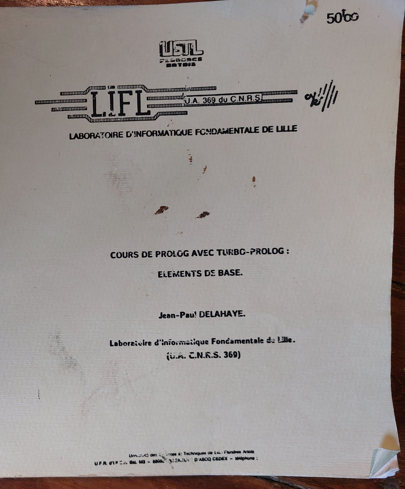

## Programmation logique

S’il y a encore quelque chose de plus pur que la programmation fonctionnelle, c’est bien la programmation logique, avec son langage emblématique, le **Prolog**. J’ai un souvenir tout particulier de ce langage car, d’abord, j’avais obtenu la meilleure note (18/20) en DESS IAGL lors de l’examen, et notre professeur s’appelait **Jean-Paul Delahaye**, mathématicien vulgarisateur reconnu ! Il écrit régulièrement des articles dans la rubrique « Logique et calcul » de la revue *Pour la science*. Il me paraissait immense, la tête dans les nuages, et surtout, planait une sorte de mystère autour de lui : il aurait été approché par la DGSE pour son expertise en cryptographie… mais chut, secret défense !

Ce qui était étonnant avec Prolog, c’est qu’on pouvait tout programmer ! Notamment, alors qu’il est construit sur la logique d’un moteur d’inférence en chaînage arrière (à partir d’un but, il déduit d’autres buts qui eux-mêmes donnent d’autres buts), on a eu un exemple de comment programmer un moteur d’inférence à chaînage avant (à partir de faits, chercher toutes les conséquences…).

Ça me donne trop envie de refaire un petit projet en Prolog, dans la rubrique IA ! à suivre ...