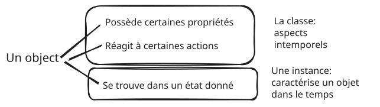
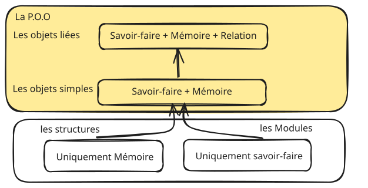
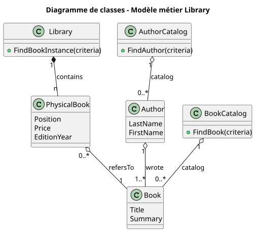
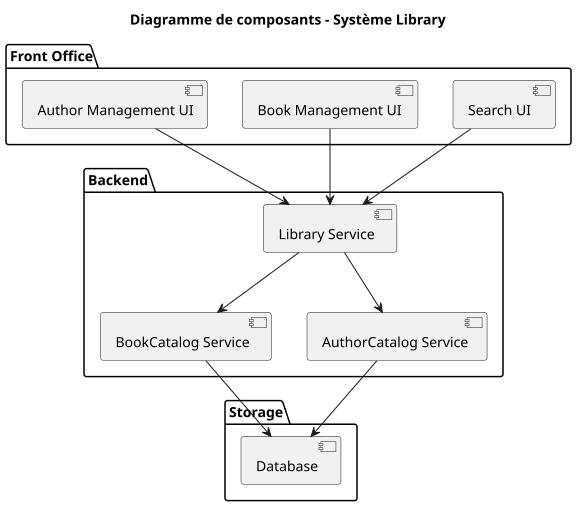
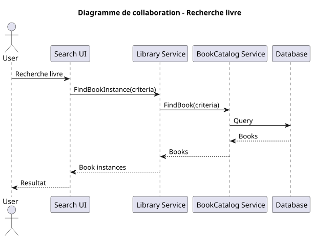
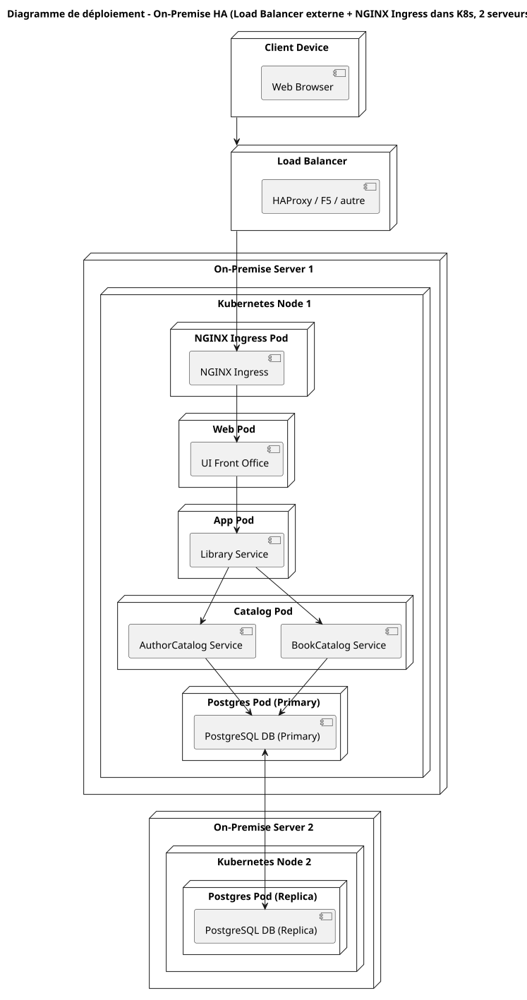
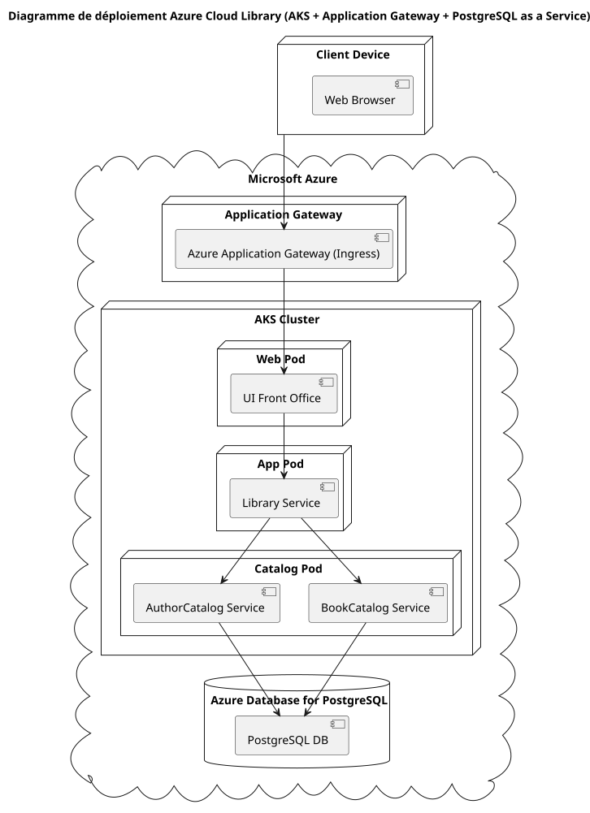

## Programmation Objet

Il y a tant à dire sur la programmation objet que je ne dirai pas tout !

Ça a été d’abord une révélation ! Je retrouvais l'esprit des ***LEGOS*** qui m'avait tant occupé enfant, cette possibilité de construire à partir de briques élémentaires, des bateaux, des camions, des châteaux, des vaisseaux spatiaux... 
Avec la programmation objet, c'est la conception elle-même qui devenait ludique !
Peut-être aussi la conséquence d’un esprit imaginatif mais le fait de voir en chaque objet une entité propre, vivante, s’exécutant, se détruisant, autonome tout en collaborant avec d’autres, c’était comme mettre en scène un petit théâtre, fabriquer un décor, animer des objets, diriger des acteurs…  
Je crois que si je ne me suis jamais ennuyé dans mon métier, c’est grâce à la programmation objet.

Et pour cause, sacrée ambition en introduction du cours magistral de Smalltalk, *la philosophie de la programmation objet est de pouvoir modéliser et simuler le réel*.
Mais c’est quoi un objet ? Encore une fois, le cours nous envoyait sur une orbite plutôt élevée. *"On sait qu’il n’est pas possible de définir rigoureusement en dehors des mathématiques, personne n’a à ce jour donné une définition mathématique d’un objet. Nous allons proposer une définition la plus rigoureuse possible bien que non complètement mathématisée"*





Le professeur de Smalltalk proposait à l’époque une grammaire graphique pour représenter un objet. C’était un langage formel qu’il avait inventé, entre diagramme d’automate et diagramme de collaboration UML, sans doute anecdotique même si c’est pertinent de considérer l’objet comme un automate.


Si la modélisation est l’objectif noble de la POO, la vraie raison pragmatique est de découper le logiciel en petites parties cohérentes (on parle de cohésion de la classe) qui peuvent être facilement réutilisées (et testées). L’industrie du logiciel ne peut pas se permettre de réinventer la roue pour chaque nouveau logiciel. Elle doit se reposer sur des composants, des objets qui ont fait leurs preuves.

Et pour cela, il y a deux concepts clés, l’encapsulation et le polymorphisme. On pourrait ajouter aussi l’héritage même s'il découle des deux premiers.

Ces deux concepts permettent donc le fondement de la programmation Objet:

*Dis-moi ce que tu fais, je te dirai qui tu es...* mais surtout pas *Comment tu fais !*

Car l’objectif est bien là, créer des notions qui isolent une certaine complexité afin de simplifier le travail des autres objets qui les utiliseront. Ce principe n’est pas spécialement nouveau pour l’informatique construite sur des couches logicielles offrant à chaque couche un niveau d’abstraction plus simple pour celle au-dessus, du hardware jusqu’aux applications de très haut niveau obéissant ainsi à l’adage *diviser pour régner*.

L’encapsulation cache donc au maximum la réalisation. Si j’ai une classe Queue qui reçoit et stocke des messages, je n’ai pas envie de savoir si elle utilise les sockets ou un fichier ou simplement la mémoire (peut-être que si mais certainement pas comment).

Bien entendu, un objet peut lui-même être composé de sous-objets ou les partager avec d'autres. Une librairie sera composée de livres, un livre pourra être associé à l’écrivain qui a lui-même écrit plusieurs livres se trouvant dans différentes librairies.

Quant au polymorphisme, quel nom curieux n’est-ce pas ? Pour comprendre, on peut penser à la classification des espèces. Un cheval est un mammifère qui est un vertébré qui appartient au règne animal. En simulation, c’est bien pratique... On peut imaginer une course d’engins à voile constitués de voiliers, de kitesurf, de planches à voile possédant des propriétés et des actions communes comme la vitesse maximale en fonction de la force et de la direction du vent, puis lancer une course en demandant à tous de partir. Chacun optimisera sa route en fonction de ses caractéristiques mais en implémentant le même comportement ‘Start’ (désolé, je simplifie à l’extrême).
Pour revenir à notre exemple de ‘Queue’, on peut avoir différentes implémentations ‘QueueMemory, QueueInFile’, partageant un moyen de recevoir des messages ‘ChannelInMemory’, ‘ChannelSocket’.
Le programme utilisera une notion abstraite Queue plutôt que l’implémentation concrète (instanciée à un point centralisé de l’application) sans se soucier de comment celle-ci fonctionne. Si on souhaite changer de type de queue, il suffira de changer à un seul endroit.
On touche là aussi une grande force de l’organisation objet, la possibilité de partager les responsabilités entre différentes équipes, l’une en charge de solutionner une partie du problème pendant que l’autre se concentre sur d’autres parties du problème en se reposant sur des abstractions même si leurs réalisations concrètes ne sont pas encore opérationnelles (quitte à utiliser une forme simplifiée ou incomplète temporairement).

Vous allez me dire, avec la programmation structurée aussi ! c’est vrai !
D’ailleurs, on peut programmer objet, au prix de quelques artifices, avec des langages non objets, comme il est tout à fait possible de programmer non-objet avec des langages objets!
Ce qui fait la qualité d’une programmation objet ou modulaire est avant tout sémantique! ***De l’importance de bien choisir le nom des classes, des méthodes, des modules ou des fonctions***.

A propos de sémantique et de monde réel, ouvrons une parenthèse anecdotique mais révélatrice d'une petite difficulté sur laquelle, comme moi, vous avez sans doute butté en commençant la POO. La plupart des langages objets proposent d’utiliser dans leur syntaxe la composition

***Sujet verbe complément***
```
pile.Empile(5);
int sommet= pile.Depile();
```
C’est bien naturel cette manière de faire, l’instance est le sujet, l’appel de la méthode est le verbe et le paramètre, le complément.
Mais ça pose quand même un problème sémantique ! Est-ce la pile qui empile 5, ou le programme qui empile 5 dans la pile ? Faut-il utiliser le verbe à l’infinitif, Empiler (ToPop en anglais) ? ou le conjuguer à la troisième personne du singulier ? empile (pops) ? ou pire, utiliser une forme passive à rallonge EstModifiéParLajoutAuSommetDe (IsModifiedByPoping) ? et puis, plus simplement, pourquoi la convention de nommage PascalCase qui s'est imposée de fait pour les langages objets (C# en tête) voudrait qu'on mette une majuscule sur un mot qui apparaîtra forcément au milieu de la phrase ?

**Ne surtout pas se prendre la tête !** ... *Ceci n'est pas une pipe !* pas une pile plutôt ! On manipule un modèle non réel et le langage informatique est une syntaxe pauvre reposant sur une grammaire non ambiguë, c'est un langage télégraphique, ce n'est pas de la littérature 😉 (est-ce que les LLM vont rabattre les cartes à ce sujet?)

Donc considérons l’objet Pile avec des capacités d’empilement et de dépilement au même titre qu’un cheval capable de partir au galop ou de revenir au pas.

```
maPile.Empile(5);
int sommet= maPile.Depile();

monCheval.Galope();
monCheval.MarcheAuPas();

```

Fermons cette petite parenthèse. La difficulté de la POO n'est ni dans la syntaxe, ni non plus dans les principes d'encapsulation ou de polymorphisme, mais bien dans la conception, dans **l'analyse Objet**! Comment modéliser le monde réel en phase avec les besoins du logiciel, comment découper les classes, comment les faire collaborer, les rendre évolutives, compréhensibles ? Comment bien isoler les aspects techniques qui pourraient être réutilisés ailleurs, qui doivent être stables et robustes, des aspects fonctionnels qui eux peuvent évoluer plus rapidement au fil des itérations ?

**C'est là que réside tout l’art ! Les langages objets n'en sont que les pinceaux.**

Isoler les aspects techniques et les rendre réutilisables est déjà assuré par les nombreuses librairies ou framework fourni avec les langages. On parle d'écosystème maintenant, ça veut tout dire. Smalltalk et ses quelques 140 classes, Win32, Borland C++, Visual C++ et les MFC, dotnet sans compter tous les frameworks tiers puis open-sources venus enrichir l'ensemble ! Il a fallu en digérer pas mal sur les 30 dernières années et ce n'est pas prêt de finir ! On avait nos livres 'bible' qui petit à petit n'ont plus que servi à rehausser les écrans, les sites Internet fournissant la documentation des API, les outils AGL tels que Visual Studio devenu DevStudio avec le browser de classes, la complétion automatique puis maintenant les ChatGPT, Copilot, tout cela au service du développeur dans cette jungle de briques et composants.

Ce qui n’a jamais empêché d’introduire, au sein d’un logiciel, ses propres classes techniques, des frameworks « maison » fournissant des abstractions stables sur lesquelles pourront s’appuyer les objets plus spécifiques au domaine du logiciel, à sa vocation, à son métier. Et pour avoir, moi-même, contribué à la mise en place de frameworks techniques tels qu’un ORM (pour assurer la persistance des objets dans une base de données), un système de communication inter-processus, ou un système de gestion de workflow (pour orchestrer les interactions complexes entre de multiples objets), je peux vous dire que c’est un sacré labeur ! Même en s’appuyant sur des frameworks existants ! C’est le prix à payer pour assurer une certaine pérennité à la couche métier, garantir qu’elle ne devienne pas trop dépendante des évolutions des frameworks externes, et surtout n’exposer que le strict nécessaire à leurs besoins…

Est-ce que cela se justifie toujours ? Question épineuse, et il n’y a pas de bonne réponse. Aujourd’hui, peut-être moins, car les frameworks éditeurs ou open source se sont sacrément enrichis. Il y a 15 ou 20 ans, c’était beaucoup moins le cas. Mais quand même : introduire notre propre couche de communication nous a permis de la faire évoluer sans trop de dégâts, d’une implémentation à base de sockets, en passant par le NetRemoting (pourtant fourni par Microsoft, mais volatilisé en plein vol), puis remplacé par SOAP/WCF, lui-même remplacé par REST…

Mais ce n'est pas trop le sujet ici, revenons plus précisément à la programmation objet.
Si une chose semble bien s'être accordée dans le temps sans trop de remise en cause, ce sont les principes dont on a esquissé l'esprit, cohésion et indépendance d'une classe, réutilisabilité etc... Et au service de ces principes, ce sont dessiné des schémas, des **patrons de conception** ou de collaboration, les *design patterns*, qu'on a su extraire des langages et des frameworks pour les rendre intemporels. Certes leur implémentation est différente suivant les possibilités plus ou moins natives des langages, leur dénomination a pu évoluer, de nouveaux sont apparus, mais on les retrouve toujours, on sait les reconnaître de la même manière qu'on sait reconnaître une voiture dans le croquis d'un enfant.

On parlait de l'importance de la sémantique, et bien évoquons les patrons de conceptions les plus emblématiques ***Gof***, *Gang of Four* car les concepteurs étaient 4. Ils ont été définis il y a 30 ans, pas si longtemps, quoique 😉, en tout cas, ils n'étaient pas enseignés à l'université sous cette forme. Ils sont pourtant aujourd'hui indissociables de la programmation Objet.

Ils ont imposé l'idée d'un vocabulaire commun, d'une sémantique très concrète au service des abstractions. Ainsi, quand on échange entre collègues, dire qu’il faudrait un **Observer**, ou mettre en place différentes **Strategies**, introduire une **Factory**, tout le monde percute sur le moyen de réaliser le besoin attendu. Il est amusant de se rendre compte qu'ils empruntent le vocabulaire à celui de l’architecture dont l’informatique toute jeune en comparaison a raison de s’inspirer (pensez donc, les pyramides ont plus de 2500 ans, 😉). Sans doute aussi que le nom d’**Architecte logiciel** provient de cette analogie. Bien entendu, ils ne sont pas les seuls, on peut en citer beaucoup d'autres qui souvent en découlent mais qui sont plus ciblés sur un contexte de problématique particulier : Interface homme machine, architecture micro-service...

Quant aux grands principes d'Architecture, au service de la maintenabilité et de l'évolutivité de nos logiciels, eux-mêmes se sont imposés à travers l'incontournable  **Low Coupling and High Cohesion** ou des acronymes tels que  **SOLID**, très évocateur du but recherché (**S**ingle responsibility principle, **O**pen/closed principle, **L**iskov substitution principle, **I**nterface segregation principle, **D**ependency inversion principle)
Je reste ici dans l'esprit 'réflexions et souvenirs' donc je ne voudrais pas trop en alourdir le contenu. Je consacrerai une page dédiée avec des illustrations de code 'Maison'😉 plus tard.

Nous avons évoqué les concepts, les langages, les patterns et les principes. Mais il nous reste à aborder le plus important : ce qui justifie tout le reste, ce qui donne un sens à tous nos efforts, à savoir la couche métier, ou plus concrètement, l’implémentation de ce que fait spécifiquement le logiciel.

Malheureusement, la POO pure, telle qu’on la rêve, composée d’objets simulant le réel, avec des classes décrivant propriétés et comportements, peut se heurter à une réalité cruelle pour nous, développeurs : elle n’est pas forcément la plus appropriée dans toutes les situations, pour tous les types de problématiques, même si on peut utiliser un langage objet pour tout programmer !

En effet, il existe des objets qui ne possèdent que des propriétés ; ce sont davantage des éléments d’information, des “records”, parfois composés de sous-objets sous forme de graphes ou de hiérarchie, mais dont les comportements se résument à peu de choses, voire à rien du tout. Pour parler plus directement, ce qui va se stocker dans les tables de la base de données SQL.

À l’opposé, il existe des objets qui n’ont pas vraiment d’état "Stateless" et qui sont là uniquement pour manipuler ces objets « record ». Quand on ne sait pas comment les nommer, ils finissent souvent affublés du nom « Manager ». Ils se bornent à sauvegarder, supprimer, alerter, vérifier, ajuster les objets « record ». Et le pire, c'est que la plupart de leurs méthodes prennent même pas le record en argument, mais un identifiant, qui n'est autre que l'identifiant du record dans la base de données SQL ! 

Tout cela pour résoudre une famille de problématiques que l’on retrouve dans 90 % des entreprises : les systèmes d’information. On manipule de l’information, mais celle-ci demeure un objet inerte, évoluant dans le temps, bien entendu, mais incapable d’expression ou de véritable autonomie.

Et la gestion des systèmes d'information n'a pas attendu la POO pour être implémentée dans les entreprises. Étudiant, j’ai fait un stage dans une entreprise dont tout le système d’information reposait sur un gros ordinateur – un AS-400 – il y a 40 ans, développé dans un langage nommé AS400, qui aurait pu être du Cobol ou autre, rien de POO là dedans ! Il fallait sauvegarder les données sur des bandes magnétiques, avec une sauvegarde chaque matin et une rotation de ces bandes chaque mois afin de conserver un mois d’historique. Finalement, ces problématiques n’ont pas tellement évolué, même si elles utilisent aujourd’hui les architectures dernier cri, à base de Cloud, de micro-services et de bases de données extensibles.

Reste que définir ce système d’information et les flux de gestion est loin d’être trivial. On les évoquait, les problématiques seront liées à l’infrastructure, au type de déploiement de la solution, au nombre d’utilisateurs...

Heureusement, avec les frameworks type ORM (Object-Relationnel mapping), Entity framework, par exemple, la possibilité du passage du monde Base de données au monde Objet nous console quand même, sans oublier aussi toute la couche UI faite à base de composants et obéissant aux fameux 'design pattern' pour donner une représentation de la manière la plus élégante possible à nos tristes 'records'.

**Et puis, nous avons un autre allié de taille** qui permet de retrouver l’esprit de la POO : **le langage UML** ! Avec ce langage, tout redevient objets : éléments d’infrastructure, composants de déploiement, processus d’exécution, bases de données, tables, composants d’UI – quelle qu’en soit la forme, web, desktop ou mobile. On décrit aussi bien le modèle d’information ou modèle métier que les services où vont tourner les fameux « Managers ».

***L’ensemble redevient un vrai ‘jeu’ de construction, du LEGO !*** pour tout architecte de 30 à 77 ans ! 😉


<div class="grid-images">

<div>
<a href="libraryArchitecture/livre2.svg"></a>
</div>
<div>
<a href="libraryArchitecture/livre2_composants.svg"></a>
</div>
<div>
<a href="libraryArchitecture/livre2_collaboration.svg"></a>
</div>
<div>
<a href="libraryArchitecture/livre2_deploiement_onprem_k8s_ha.svg"></a>
</div>
<div>
<a href="libraryArchitecture/livre2_deploiement_cloud_azure.svg"></a>
</div>
</div>
