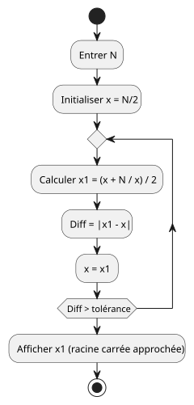
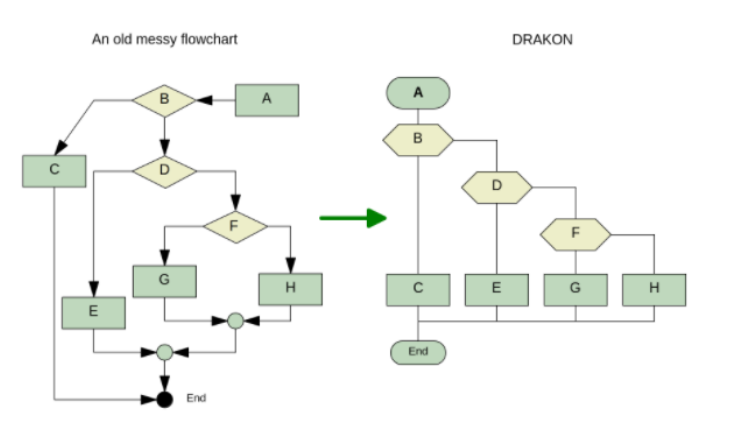
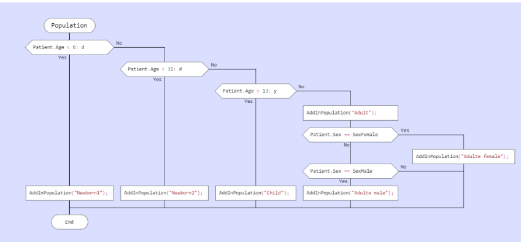
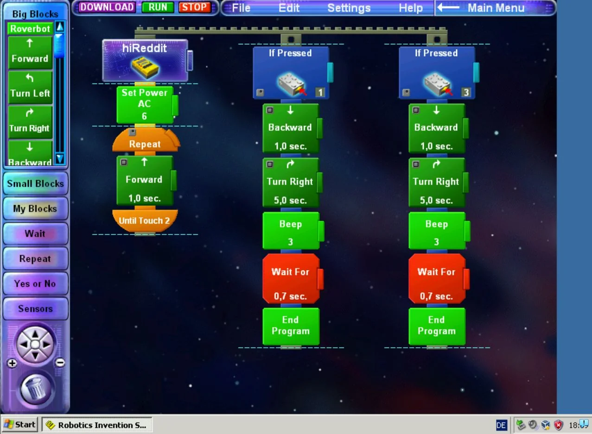
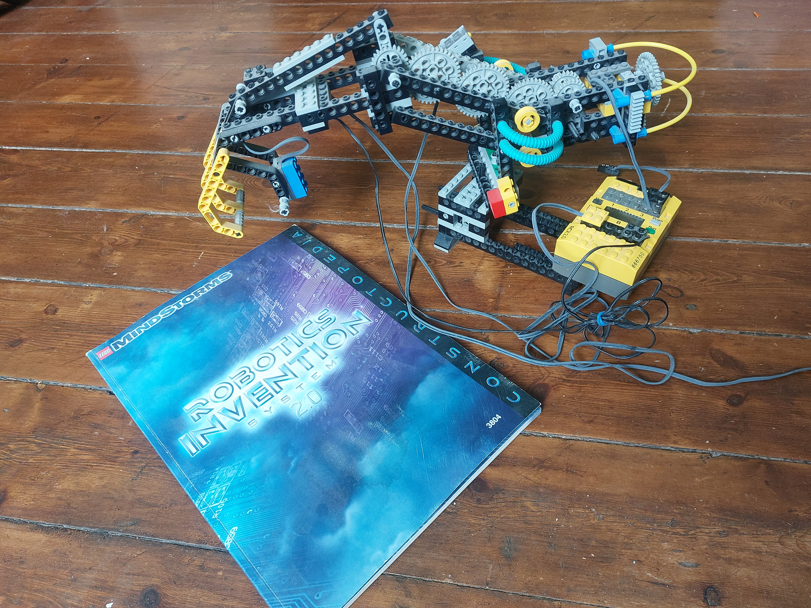

## Programmation par diagramme et modèles visuels

J’évoquais le langage **UML**, très lié à la POO et aux outils de modélisation : Visio, Enterprise Architect… Mais avant lui, il y a eu **Merise** ! Ça date, n’est-ce pas ? Je ne peux pas dire que je m’en souvienne énormément, sauf sur un point.

Il se trouve que j’ai fait le service militaire, l’une des dernières générations…  
Pas besoin de piston, les informaticiens étaient assurés de trouver une fonction dans les bureaux du ministère ou à Taverny, le cœur secret de la dissuasion nucléaire, refuge pour le président de la République et l’état-major en cas de conflit. Mais pour y rentrer, encore fallait-il réussir le test du capitaine en charge des affectations !  
Un copain, bien renseigné, m’avait dit : "C’est simple, il va te poser une seule question : 'Est-ce que vous connaissez la méthode Merise ?' Tu réponds oui ! Il n’y connaît rien." 😄  
J’ai suivi son conseil, avec un aplomb au moins aussi fort que mon interlocuteur, et bingo ! J’ai pu effectuer mon service militaire dans le tunnel, et j’avoue que, contre toute attente, je n’ai pas du tout perdu mon temps pendant ces dix mois.

*Mais la méthode Merise ne m’a servi que ce jour-là 😄 !*

Pour être plus exact, je l’ai certainement utilisée, sans le formalisme, tel Monsieur Jourdain faisant de la poésie !

Une autre technique qui a eu son heure de gloire, il y a plus de 30 ans, c’est l’organigramme, prisé pour visualiser des algorithmes plus ou moins compliqués. Il faut dire qu’ils étaient sûrement utiles avec la programmation Goto, beaucoup moins avec la programmation structurée.  
Le langage texte reste quand même plus concis, ce qui n’empêche que suivre le chemin avec le doigt nous permet souvent une compréhension profonde de l’algorithme, sans avoir besoin de débugger pas à pas le programme l’implémentant.



```` Python
def babylon_sqrt(N, tolerance=1e-10, verbose=True):
    x = N / 2  # valeur initiale
    iteration = 0

    while True:
        x1 = (x + N / x) / 2
        diff = abs(x1 - x)
        if verbose:
            print(f"Iteration {iteration}: x={x}, x1={x1}, diff={diff}")
        if diff < tolerance:
            break
        x = x1
        iteration += 1

    print(f"\nLa racine carrée approximative de {N} est : {x1}")
    return x1

N = float(input("Entrez un nombre : "))
babylon_sqrt(N)
````

Lors d’un hackathon organisé par l’entreprise, je cherchais un moyen de proposer un éditeur graphique de règles métier aux utilisateurs, plutôt que d’utiliser le langage de script propriétaire que nous avions développé. En cherchant un peu comment fournir un outil simple à utiliser, je suis tombé sur DRAKON.  
C’était un langage graphique inventé par les Russes pour programmer le système embarqué de leur navette spatiale Bourane, qui n’a fait qu’un seul vol avant d’être abandonnée dans le contexte de chamboulement de l’URSS.  
J’ai été séduit par la logique proposée par l’éditeur Drakon, justement pour éviter l’effet spaghetti et désordonné qu’on pouvait obtenir avec un éditeur classique et j'ai proposé un POC en utilisant une librairie Javascript 'msgraph.js' très puissante.

<div class="grid-images">

<div>
<a href="drakon.png"></a>
</div>
<div>
<a href="rules.png"></a>
</div>
</div>

Pour revenir au langage UML, il a été très longtemps à la mode. Qui ne le connaissait pas ne pouvait pas se targuer de maîtriser l’analyse objet ! Il fut une époque aussi où l’on voulait un langage graphique aussi rigoureux qu’un langage texte, afin de justement pouvoir générer du code à partir de lui. Il fallait qu’il n’y ait aucune ambiguïté !  

Par contre, UML était un peu trop généraliste. C’est alors qu’une approche opposée a vu le jour : le DSL (Domain Specific Language). L’idée était de définir un langage graphique spécifique à un métier. Microsoft fournissait un SDK pour permettre de définir son propre langage et l’éditer directement dans DevStudio. 

J’ai trouvé cela très, trop compliqué…  
Nous cherchions aussi à exprimer la complexité du métier de notre logiciel à travers un langage graphique qui deviendrait la source aussi bien documentaire qu’exécutée donc générée sous forme de code. Nous avons alors défini un sous-ensemble UML composé de diagrammes d’état et de diagrammes d’activité. J’expliquerai cette démarche dans un article dédié, avec ses avantages et ses inconvénients.

En tout cas, aujourd’hui encore, on utilise énormément UML dans nos documentations, grâce notamment à PlantUML qui présente un intérêt imparable : c’est du texte donc versionnable dans  Git !

Par contre, ce n’est pas toujours simple d’obtenir le rendu souhaité : la position des éléments ne fait pas partie du langage, ce qui est à la fois sa force (pas de fioritures) et sa faiblesse (il faut parfois ajouter des liens invisibles pour positionner correctement les éléments, ce qui peut alourdir le diagramme). Un autre concurrent, Mermaid, est un peu plus simple, moins complet, mais son rendu au sein d’un document `.md` est supporté nativement par ADO ou GitHub.

Face à la difficulté d’obtenir les positions qu’on souhaite, émerge un autre outil, prisé par les Product Owners ou les non spécialistes d’UML : Excalidraw. Il a l’avantage de combiner le rendu au format SVG ou PNG, avec des méta-informations vectorielles permettant de l’éditer et le modifier facilement dans Visual Studio Code.

Je voudrais finir avec quelque chose de plus ludique. Quand mes enfants étaient enfants — oui, maintenant ils sont beaucoup plus grands — j’ai eu très envie de les initier à la programmation. Et quoi de mieux que les Lego Mindstorms !  
Bon, comme tout papa qui offre un train électrique à son fiston, on peut se demander si ce n’est pas plus pour lui 😄. Ceci étant dit, ils sont ingénieurs, pas informaticiens, mais ils utilisent Python tous les jours !

Mais qu’est-ce que j’aurais aimé avoir des Legos Mindstorms moi-même étant enfant!  
L’éditeur de programme était complètement graphique, sorte de **Scratch** avant l'heure, à base de briques structurées et d’événements renvoyés par les capteurs. Une fois le programme terminé, il fallait l’envoyer vers la brique RCX (via une communication par infrarouge, ce qui ne marchait pas toujours très bien… Il y a eu des progrès avec les générations Mindstorms suivantes !).

***Finalement, comme une synthèse ludique de ce qui fait le cœur et l’esprit de la programmation... !***

<div class="grid-images">

<div>
<a href="mindstorms.png"></a>
</div>
<div>
<a href="robotbras.jpg"></a>
</div>
</div>
