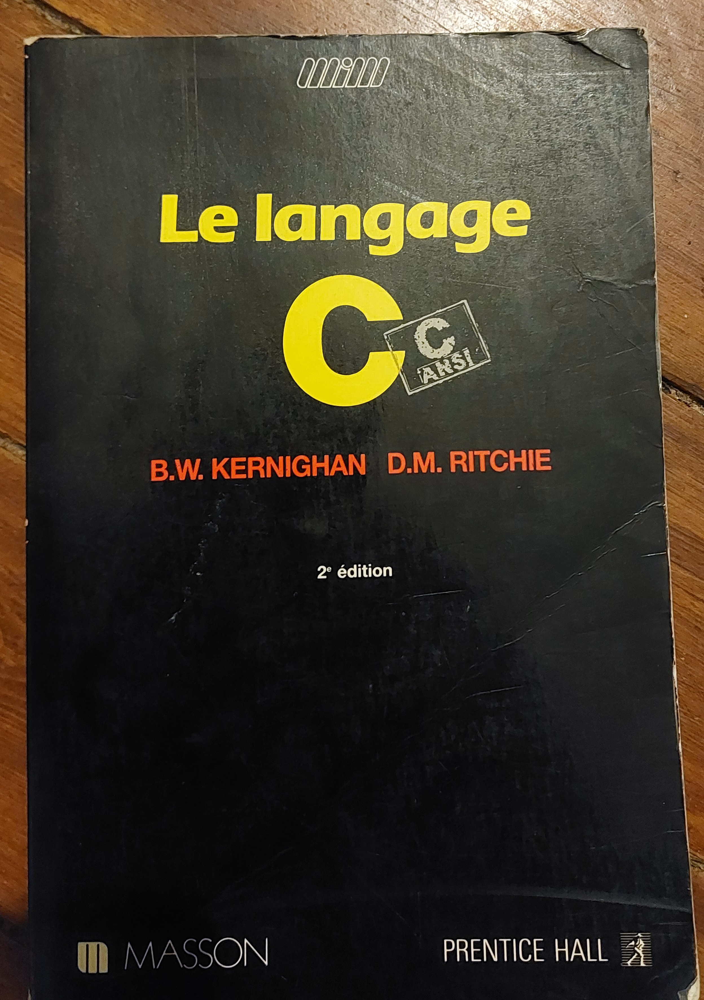

## Programmation structurée et impérative

La programmation structurée a apporté la lisibilité et la maintenabilité avec l’apparition des blocs (`if`, `while`, `for`) et la notion de procédures, de fonctions et de modules. Adieu les Jump et le code spaghetti ! Évitons le plus de bugs et l’incompréhension de celui qui n’a pas écrit le bout de code ou de celui qui l’a écrit mais qui le relit deux mois après, ce qui revient souvent au même 😉!

Le **langage C** bien entendu est le plus emblématique, mais souvenons-nous du **Turbo-Pascal** qui, bien avant Python, fut le langage d’apprentissage dans les premières années du supérieur, classe Prépa ou universitaire (ah, programmer le PGCD !).

Ensuite, en ce qui me concerne, c’était le langage **Ada** dès la licence d’informatique. Encore plus sérieux car répondant au cahier des charges de la défense américaine pour pouvoir être embarqué dans le système de guidage de missiles ! Autant dire, pas le droit au bug ! Il a introduit des concepts clés comme l’organisation en paquetages (un peu comme une classe de la POO), la programmation générique, la possibilité d’associer les opérateurs mathématiques classiques à de nouveaux types. On pouvait donc additionner ou multiplier des matrices ou des nombres complexes avec des expressions proches de l’écriture mathématique. La programmation multitâche était aussi d’une grande clarté avec les concepts clés natifs au langage comme la notion de Tâche (Task) et de rendez-vous (accept).

J’avoue humblement que je préférais le côté sauvage et brut du **langage C**, plus proche du système. J’ai trop associé Ada à ces cours ennuyeux en amphi à regarder le prof passer en revue les instructions ou décrire ce que faisait tel ou tel programme (pire que les réunions de code review 😉) et surtout à l’examen de fin d’année où il fallait écrire le programme sur papier ! Quelle horreur ! On ne pouvait même pas déboguer. 😄

Et surtout, ce que j’ai aimé le plus avec le **langage C**, c’était le sujet de TP de maîtrise : la réalisation d’un mini-compilateur Pascal avec son interpréteur de P-Code. En plus, on pouvait utiliser les outils Unix Lex et Yacc ! Oui, le langage était bien au cœur d’Unix (Linux, sur mon PC en double boot). Installer une nouvelle version de Linux, c’était recompiler le noyau écrit en langage C ! Quant à comprendre comment on passait de la programmation structurée du mini Pascal au **Jump** du P-code, *la boucle était bouclée*, on peut le dire !

Une autre relique :

