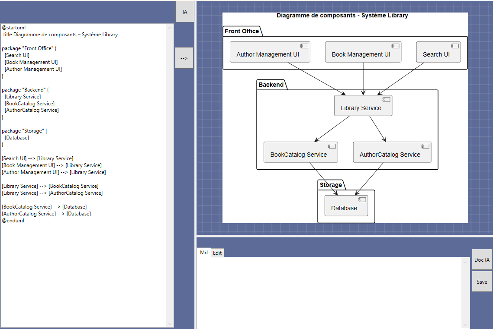

# Naviguer dans le diagramme

Pendant de nombreuses années, nous avions centralisé toute la documentation et les diagrammes UML dans Enterprise Architect.
Mais encore une fois, l'avènement de Git, avec sa gestion puissante des conflits sur le texte, nous a fait migrer petit à petit vers des documentations Markdown ou Asciidoc contenant des diagrammes PlantUML ou Mermaid.

Pendant une autre semaine d'innovation (et oui, j'ai toujours aimé les semaines d'innovation au sein de mon entreprise ☺️), j'ai testé le reverse engineering avec GPT-4.1 pour obtenir des diagrammes UML et de la documentation de design.
Outre le format texte de PlantUML facilitant la gestion des conflits Git, son gros avantage est qu'il est facilement 'apris' par les LLM génératifs.
Évidemment, le reverse engineering à partir de l'IA est quand même moins rigoureux que lorsqu'on utilise Roslyn par exemple, mais pour des use cases, des diagrammes de collaboration ou de séquences, c'est d'une puissance incroyable et on obtient un résultat bien suffisant (à corriger quand même!) pour la compréhension globale d'un projet.

J'ai donc développé une autre extension afin de visualiser, au sein de Visual Studio, les diagrammes UML obtenus. Le moteur PlantUML tourne en local et génère un .svg à partir du texte, qu'on peut ensuite afficher dans un composant WebBrowser (il existe des extensions sur le même principe pour VSCode).




Mais je trouve deux défauts à PlantUML :

- D'abord, il n'y a pas d'interaction possible. Je voulais la même possibilité que ce qu'on avait dans Visual Studio avec les diagrammes d'Entity Framework : la possibilité, en cliquant sur un élément, d'ouvrir le source de l'objet en question.
Par exemple, à partir d'un diagramme de composants représentant toutes les couches, je voulais qu'un double-clic sur un composant puisse ouvrir la solution Visual Studio et sélectionner le projet en question. De même, à partir d'un diagramme de classe, cliquer sur une méthode nous ouvrait la classe correspondante et sélectionnait automatiquement la méthode.
- Le second défaut, comme je l'ai déjà dit, est la difficulté à contrôler de manière précise le positionnement, hormis via des directions (Right, Left, Up, Down) sur les liaisons et des distances (-, --, ---), parfois au prix de rajouter des liens cachés, ce qui alourdit d'une autre manière le script. Ainsi, il nous est arrivé de préférer utiliser Excalidraw 🫢 pour des docs de design contenant des diagrammes d'architecture haut niveau en C4! 

**Des explorations de solutions:**

- Pour le premier point, j'avais trouvé une librairie open source assez intéressante : https://github.com/ElinamLLC/SharpVectors
, qui permet de convertir un SVG en XAML. L'intérêt ? Pas besoin d'utiliser un contrôle WebViewer pour l'afficher : on peut directement l'afficher dans un Canvas. Et surtout, il est possible de mettre un peu d'interaction en gérant la sélection d'un élément. Mais rien n'est jamais parfait dans ce bas monde : le SVG obtenu via le moteur PlantUML est assez complexe, et la sélection d'éléments pouvait ne pas être suffisamment atomique.
- Pour le second point, je me suis amusé à imaginer une extension de grammaire avec l'objectif de rester compatible avec PlantUML. Le moyen simple consiste à ajouter des informations codifiées dans des commentaires près de l'objet en question. Pour conserver une certaine souplesse de layout, je me suis inspiré des grids XAML, où l'on peut définir un quadrillage avec tailles fixes ou adaptatives et associer les éléments à une position (ligne, colonne) dans cette grille. Évidemment, cela nécessite de développer son propre moteur PlantUML et surtout un parser complet (Vive ANTLR) ! Inutile de dire que c'était même pas la peine de proposer ça dans le cadre de l'entreprise 🤣.


```[PlantUml]
' Définition globale de la grille
@startuml
'@layout grid rows=2 cols=3
'@layout row-heights=Auto,*
'@layout col-widths=200,*,*

' Placement des éléments
'@layout cell row=0 col=0
component Frontend

'@layout cell row=0 col=1 colspan=2
component "API Gateway" as API

'@layout cell row=1 col=0
component "Service A" as SA

'@layout cell row=1 col=1
component "Service B" as SB

'@layout cell row=1 col=2
component DB

' Liens (optionnel)
Frontend --> API
API --> SA
API --> SB
API --> DB

@enduml
```

Ca m'a donné trés envie de retravailler sur ses aspects sur mon temps libre, d'où un petit chantier pas si modeste que ça : [PatGraph framework](/Chantiers navals/PatGraph framework).
