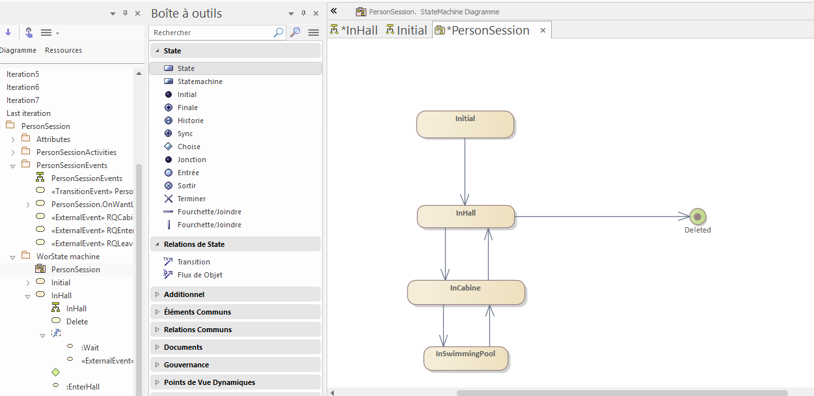
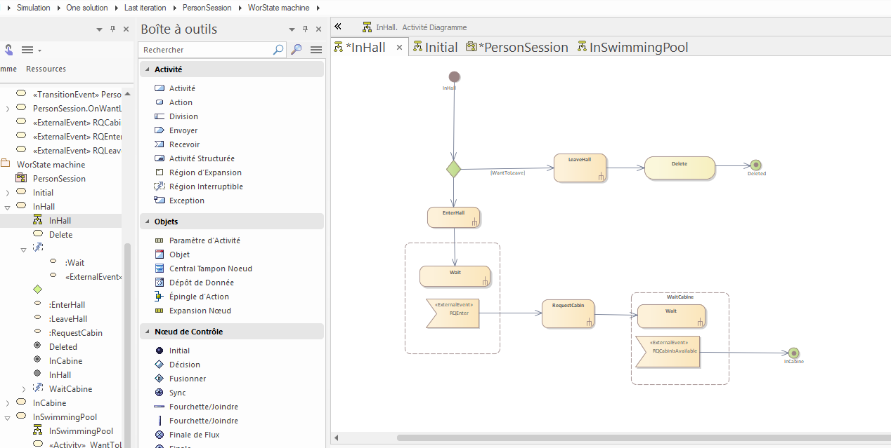
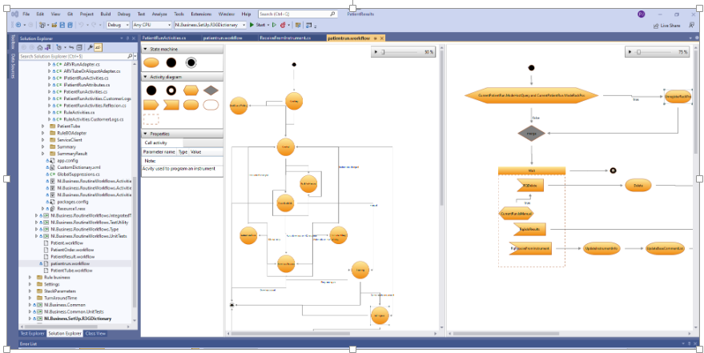

# Des diagrammes vers le code: une expérience DSL

***« Un bon croquis vaut mieux qu'un long discours »***

*Napoléon*

Pour modéliser la complexité du workflow métier de notre logiciel, nous avions utilisé un sous-ensemble des machines à états et des diagrammes d'activité d'UML. L'objectif était que la vérité se trouve dans ces diagrammes, donnant ainsi une vue d'ensemble documentaire tout en étant aussi rigoureux que du code, et pour cause : l'objectif était de générer du code à partir des diagrammes.

Nous avions utilisé Enterprise Architect qui offre une API très complète pour naviguer dans les objets du modèle et donc des diagrammes (on aurait pu utiliser aussi l'export au format XMI et mapper le contenu XML sur une structure objet). À partir de la navigation dans ces objets (pattern composite), il n'était pas trop compliqué de générer du code. Toute la difficulté était plus dans la conception des diagrammes eux-mêmes. Jusqu'à quel niveau de détail fallait-il « les descendre » ? Pour ne pas inverser le bénéfice, les diagrammes devaient donner une bonne vue d'ensemble des interactions mais ne pas implémenter tous les aspects. Le diagramme d'activité était donc constitué d'activités qui, elles, étaient codées en C#.

La contrepartie était que, comme tout langage, il fallait former les développeurs à son usage. J'ai ainsi élaboré un tutoriel qui n'avait rien à voir avec le métier du logiciel de l'entreprise puisqu'il s'agissait de simuler les flux d'entrée/sortie dans une piscine avec un nombre de cabines limité et un temps aléatoire de présence dans le bassin.

La grammaire de ce langage graphique était à la fois un sous-ensemble UML mais utilisait en même temps des notions qu'on ne retrouve pas forcément dans d'autres outils UML tels que PlantUML. Par exemple, la possibilité d'être dans une zone d'attente événementielle où seuls certains événements (stimuli extérieurs ou internes à l'objet) sont acceptés et traitables. Chaque zone d'attente événementielle pouvait aussi être interrompue par un délai paramétrable permettant de se remettre dans un état précédent. Ça a été une manière de coder le pattern SAGA (qu'on aurait pu consolider via une logique outbox côté notificateur de la transaction) en retentant X fois une action tant qu'on n'avait pas reçu la notification de réussite avant de considérer l'échec et donc le retour dans un état précédent mais stable).

Malheureusement, deux points négatifs se sont révélés à l'usage.
L'outil Enterprise Architect est très complet mais assez compliqué et surtout un peu permissif. Il est possible de faire ce qu'on veut dans le diagramme, peut-être pas autant qu'avec un logiciel de dessin mais pas loin :

- Les développeurs redoutaient donc de modifier les diagrammes avec cet outil, trop compliqué à leur goût et souvent source d'erreurs, même si la plupart des incohérences étaient détectables par le générateur de code. Parfois, pour gagner du temps, ils modifiaient directement le code généré, ce qui était à l'opposé du but recherché et catastrophique lorsqu'une génération à partir des diagrammes perdait de fait les modifications sauvages.
- Le second point problématique était la gestion des conflits dans Git. Git, c'est l'outil dont on se demande comment on faisait avant que ça n'existe ! Mais gérer les différences sur du XMI, ou sur du code généré dont l'objectif est justement d'éviter de mettre le nez dedans, ce n'était plus vraiment viable. Nous avions acheté LemonTree pour ça, mais quelle usine aussi !

Pendant une semaine d'innovation, j'ai donc travaillé sur un POC afin d'avoir son propre éditeur embarqué dans Visual Studio. L'idée était de définir un langage de stockage un peu comme PlantUML, lisible et modifiable, tout en contrôlant la position des différents éléments, ce que permet difficilement PlantUML, même si c'est justement sa grande force en ne « polluant » pas le code d'informations alourdissantes.

J'ai pu évoquer aussi que j'avais envisagé d'étudier le framework DSL de Microsoft, mais je l'ai trouvé vraiment trop complexe. Sa maîtrise nécessitait pas mal d'investissement en temps et, quand ce n'est pas le cœur de métier de l'entreprise, ce n'est pas toujours justifiable.

Par contre, contre toute attente, utiliser un framework graphique n'est pas si compliqué. Hélas, la plupart sont chers en licence et nous couplent avec un fournisseur de solution (ex : DevExpress, MindFusion...).
Pour le POC, j'avais utilisé une librairie open source trouvée sur CodeProject de la grande époque, dont il existe encore un fork aujourd'hui sur GitHub : https://github.com/jogibear9988/DiagrammDesigner
.

Par contre, chaque élément du diagramme est un Control. Au bout d'une centaine d'éléments, le rafraîchissement commençait à devenir lent. Ensuite, la gestion des edges n'était pas suffisamment aboutie et je n'ai jamais eu le temps de l'améliorer, car la priorité était davantage sur les fonctionnalités pour l'utilisateur final et non pour travailler sur nos outillages internes. **Donc, nous sommes hélas restés sur la solution EA.**

