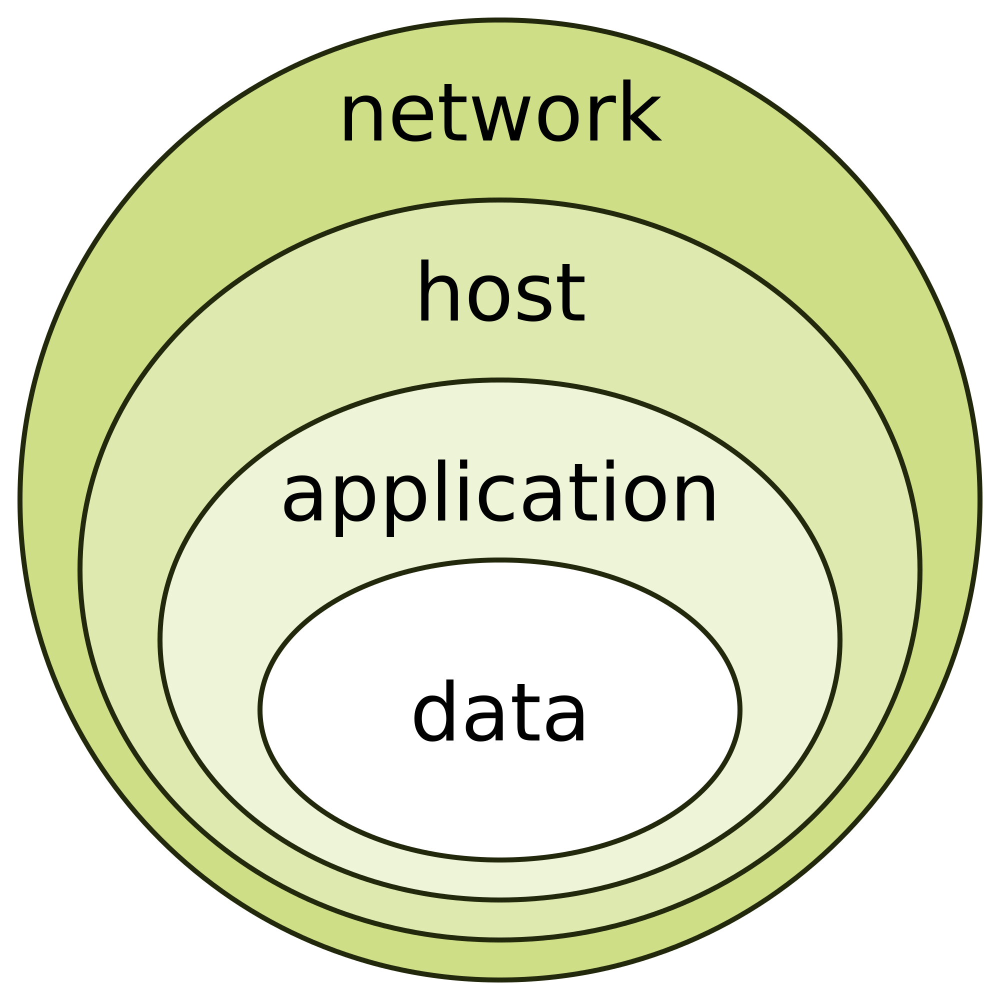

# 🏴‍☠️ Pirates & Survie (P&S)

*Sécurité, résilience et protection des données dans les systèmes logiciels*  = **Privacy and Security**

J'avoue avoir mis un certain temps avant de m'intéresser aux questions de sécurité informatique. Peut-être naif ou idéaliste, je jugeais un peu trop paranoïaques les spécialistes P&S. Je me souviens particulièrement d’un responsable P&S américain, armoire à glace cravatée, qui bouchait la caméra de son portable avec du scotch opaque, limitait son utilisation au strict minimum et ne l’apportait jamais en réunion.

Il nous expliquait pendant des heures "l’oignon de sécurité", les multiples couches de protection que nous devions mettre en œuvre… alors que dans certains labos, clients de notre solution, le mot de passe pouvait être écrit sur un Post-it, juste à côté de l’écran ! Comme cela demandait pas mal d’efforts de développement pour des scénarios de hacking que nous avions du mal à imaginer réalisables, et souvent au détriment de fonctionnalités plus utiles, le P&S n’avait pas vraiment la côte chez les développeurs.

On perçoit forcement dans l'activité des pirates ou des hackers une débauche d'énergie et d'intelligence inutiles et nuisibles pour réaliser leurs fameux exploits alors qu'il y a certainement mieux à faire  mais il faut bien reconnaître qu’à l’instar des créateurs de jeux vidéo, il y a parmi les hackers des gens vraiment brillants, maitrisant les tréfonds de l’informatique, du réseau, de la cryptographie, du langage machine, de l’électronique (le film WarGames a durablement ancré dans l’imaginaire l’archétype d'un jeune *David* surdoué mettant en branle le *Goliath* de la défense américaine).

J'entendais l'autre jour parler de systèmes capables de capturer à distance l'empreinte radio des clés électroniques d'une voiture laissée sur le rebord d’un meuble à l’intérieur de la maison… avant de s’enfuir avec la voiture stationnée devant le garage. Il faut quand même maitriser une bonne part d'ingénieurie pour concevoir ce genre de système même si les voleurs n'en sont souvent que de simples utilisateurs.
Je n'ai pas pu m'empecher de penser que si la victime avait mis sa voiture dans le garage fermé à clé, avait acheté une caméra rélié à un centre de surveillance, avait rangé sa clé de voiture dans un coffre en fer et avait ajouté un système anti-vol sur le volant, elle n'aurait pas eu à constater sa pauvre mésaventure. Les differentes couches de protection ... Et pourtant, personne ne le fait, ou seulement aprés être devenue une victime

Mais c'est un fait, le monde du numérique est regulièrement la cible d'attaque en tout genre (virus, intrusion, vol de données, blocage de système avec demande de rançon). L'actualité nous colporte souvent des attaques contre les institutions publiques, Hopitaux, écoles...

Le P&S ne traite pas uniquement les attaques de pirates puisqu'il s'agit de prévoir aussi les aléas 'naturels', bugs logiciel, erreurs humaines,panne matériel ou réseau, départ de collaborateur nécessitant le changement de mots de passe, de certificat, d'API keys ...

Du fait de l'activité dans le domaine médical, tout nos logiciels devaient présenter un **plan P&S** couvrant l'ensemble des aspects (même quand pas directement concerné par un point, il fallait justifier en quoi ça ne l'était pas).

*Finalement, concevoir un projet logiciel, c’est un peu comme piloter un navire du 17ème siècle au milieu des caraibes*. 
Les menaces sont partout, espionnage, piraterie, corsaires enemis, tempêtes, vents contraires, récifs. Et tout comme un capitaine ne peut pas contrôler la mer, un architecte logiciel ne peut pas contrôler toutes les attaques… mais il doit **préparer le navire pour assurer la meilleure chance de survie de l'équipage**.

##  Une vision Longue-vue du P&S

Pour qu’un navire tienne la mer, il faut penser à tous les aspects :  

- **Authentification** : qui est à bord ?  
- **Autorisation** : qui a le droit de manœuvrer le gouvernail ?  
- **Chiffrement** : qui peut lire les messages dans les bouteilles ?  
- **Secrets** : où sont rangées les cartes et les clés du trésor ?  
- **Protection du réseau,code** : quelles portes restent ouvertes aux intrus ?  
- **Résilience** : que faire si une voile se déchire en pleine tempête ?

Chaque aspect est lié aux autres : un maillon faible peut compromettre tout le navire.

Évidemment, on ne prépare pas un navire de la même manière pour faire du cabotage que pour traverser l’Atlantique.  
Il en va de même pour un logiciel : le plan P&S se définit en même temps que l’architecture de haut niveau.

Une application interne, peu exposée, n’aura pas les mêmes exigences qu’un système distribué en microservices, manipulant des données patients, déployé dans le cloud avec un frontal web exposé sur Internet.

Dans nos projets, cette réflexion passe systématiquement par une phase de **threat modeling**.

Microsoft propose un outil dédié, *Microsoft Threat Modeling Tool*, qui permet de :
- modéliser les composants de la solution  
- représenter les flux de données  
- identifier les systèmes de stockage  
- préciser les protocoles de communication  

À partir de ce modèle, l’outil génère une liste de menaces potentielles pour chaque composant et chaque interaction.

Pour chacune de ces menaces, il faut :
- évaluer le risque  
- définir une stratégie de mitigation  
- ou justifier pourquoi elle ne s’applique pas  

Vu le nombre de menaces possibles, c'est trés trés laborieux mais c'est un exercice incontournable ne serait-ce que pour prendre conscience des failles potentielles.

## 3. Authentification : savoir qui est à bord

Il faut distinguer 2 aspects :

- L'authentification d'un utilisateur pour utiliser le logiciel ou une partie (avec plus ou moins de droits = **Autorisation**)
- L'authentification d'un composant pour utiliser un autre composant

Dans un cas, le mot de passe est dans la tête de la personne ; dans l'autre, il faut bien le mettre quelque part… et c'est là que ça peut se compliquer pas mal.

**En ce qui concerne l'utilisateur**, il y a plusieurs techniques. Ce qui est généralement appréciable pour lui, c'est de ne pas avoir à mémoriser x mots de passe.  
Donc dans une solution d’entreprise, il faudra essayer de connecter le système d’authentification à une fédération (un serveur LDAP ou Active Directory centralisant le couple login/password).

Il fut un temps où c'était naturel que chaque application développe son propre système d'authentification (une boîte de dialogue login/mot de passe). On pouvait aussi se reposer simplement sur l'authentification au niveau de l'OS (Windows, Linux) faisant partie du domaine de l'entreprise, et utiliser l’utilisateur courant pour gérer ensuite les aspects d’autorisation en fonction des droits, qui restent le plus souvent un paramétrage au sein de l'application.

Les applications modernes (généralement en techno Web) se reposent plutôt sur des systèmes tiers implémentant des protocoles comme OAuth2 / OpenID Connect, tels que Keycloak (facilement déployable dans Docker ou Kubernetes) ou Azure AD, relié ou non à l’Active Directory de l'entreprise.

L'intérêt est que toute la gestion complexe de la politique des mots de passe ou des systèmes MFA (double authentification, appli sur smartphone type Authenticator) est fournie, et en général bien implémentée, ce qui limite fortement les risques de faille de sécurité.

Dans tous les cas, le mot de passe ne doit jamais être transmis en clair. Pour cela, on utilisera HTTPS/TLS reposant sur un système de chiffrement asymétrique à base de clés privée et publique stockées dans des certificats, tel qu’expliqué plus loin.

**Pour les composants** (système de base de données, services de l'application, composants tiers), idem, il y a plusieurs techniques dépendant de chaque cas.

- Pour le service de base de données, c'est classiquement un login/password, mais qui doivent être connus par l'application cliente.  

- Pour les services API REST, surtout ceux tournant sur le cloud, ils seront protégés via une clé API (souvent sous forme de JWT). Mais là encore, celle-ci doit être connue du client.

- Un moyen en vogue est d'utiliser le **mTLS** (mutual TLS) qui permet d'identifier le client auprés du composant serveur.
  J'explique un peu plus précisement dans le point suivant.

Mais que ce soit le couple login/password, la clé API ou le certificat client, ils doivent être stockés de manière sécurisée.  
Ce sont des **secrets**. En aucun cas ils ne doivent être hardcodés au sein du code client ni fournis sous forme de fichiers accessibles à tout vent.

## 4. Chiffrement : protéger les messages et le trésor

Le chiffrement concerne deux dimensions :  

- **En transit** : protéger les communications entre services  
- **Au repos** : protéger les données stockées  

### Chiffrement en transit

Pour le transit, il n’y a pas à tergiverser : il faut utiliser TLS (HTTPS).  
Évidemment, la gestion des certificats n’est pas triviale… mais il faut y passer.

Pour comprendre TLS, il faut d’abord introduire la notion de certificat.

Un certificat contient une **clé publique**, des informations d’identité (nom du serveur, organisation, etc.) ainsi qu’une **signature** d’une autorité de certification (CA).  
La **clé privée associée**, elle, reste secrète côté serveur et ne doit jamais être exposée.

Un point important : un certificat ne sert pas à chiffrer directement les données. Il sert à **authentifier** le serveur et à permettre l’établissement sécurisé d’une clé de session.

Côté formats, on croise souvent des fichiers `.crt`, `.pem`, `.p12` ou `.key`. Certains contiennent uniquement des certificats, d’autres incluent aussi la clé privée. Par exemple, un `.p12` contient généralement certificat + clé privée, alors qu’un `.crt` ne contient que le certificat. Le format `.pem`, lui, est un peu fourre-tout et peut contenir l’un, l’autre, ou les deux. OpenSSL est l’outil standard pour créer ou convertir entre ces formats.

| Format | Contient la clé privée ? | Encodage | Usage |
|--------|--------------------------|----------|-------|
| `.p7b` / `.p7c` (PKCS#7) | ❌ Non | PEM ou DER | Chaîne de certificats (sans clé privée) |
| `.pfx` / `.p12` (PKCS#12) | ✅ Oui | Binaire | Certificat + clé privée (stockage sécurisé) |
| `.crt` / `.cer` | ❌ Non | PEM ou DER | Certificat seul |
| `.pem` | ❓ Parfois | Base64 (PEM) | Peut contenir certificat, clé privée ou les deux |
| `.der` | ❌ Non | Binaire | Version binaire d’un certificat |
| `.key` | ✅ Oui | Base64 (PEM) | Clé privée seule |

Un certificat racine est soit déjà présent sur le client (navigateurs, OS), car fourni par des autorités reconnues, soit à installer manuellement dans des environnements privés. Toute la confiance repose sur cette chaîne : si elle n’est pas valide, le certificat n’est pas considéré comme fiable.

Dans le cas d’une application exposée sur Internet, on utilise généralement un certificat signé par une autorité de certification reconnue. Ces certificats sont délivrés par des organismes spécialisés, souvent payants, même s’il existe aujourd’hui des alternatives gratuites comme Let’s Encrypt.  
Dans un environnement interne, on peut utiliser sa propre autorité de certification, mais il faut alors déployer le certificat racine sur tous les clients.

Pour comprendre ce qui se passe réellement, il faut regarder le handshake TLS, c’est-à-dire la phase initiale où le client et le serveur se mettent d’accord pour établir une connexion sécurisée.

Le serveur commence par envoyer son certificat (qui contient sa clé publique), ainsi que les certificats intermédiaires nécessaires. Le certificat racine, lui, n’est pas envoyé : il est supposé stocké coté client.

Le client va alors vérifier que le certificat est valide, reconstruire la chaîne de confiance (racine → intermédiaire → serveur) et s’assurer que la racine fait bien partie de ses autorités de confiance. Si ce n’est pas le cas, la connexion est considérée comme non fiable.

Une fois cette vérification faite, il faut établir une clé de session pour chiffrer les échanges. Contrairement à ce qu’on pourrait penser, cette clé n’est pas envoyée sur le réseau. Dans les versions modernes de TLS (TLS 1.2 avec ECDHE et TLS 1.3), elle est **dérivée des deux côtés** à l’aide d’un mécanisme d’échange de clés (Diffie-Hellman éphémère).

On obtient ainsi une clé symétrique (typiquement AES), utilisée pour chiffrer toute la communication de manière efficace, bien plus rapide que l’asymétrique.

Ce mécanisme apporte une propriété essentielle : la Perfect Forward Secrecy. Concrètement, cela signifie que même si la clé privée du serveur est compromise plus tard, les anciennes sessions ne peuvent pas être déchiffrées. Chaque session est indépendante.

Dans le cas du mTLS, le principe est similaire mais avec authentification des deux côtés. Le serveur demande également un certificat au client. Le serveur verifie aussi la chaine de confiance, eventuellement certaines infos du certificat (le code de verification peut être intercepté et customisé en dotnet ou autre ). Le client doit ensuite prouver qu’il possède la clé privée associée (le serveur envoie un challenge ie une donnée à signer). On n’authentifie donc plus seulement le serveur, mais aussi le client.

Enfin, sur la question du déchiffrement : en pratique, intercepter une session TLS ne suffit pas. Un attaquant devrait non seulement capturer le trafic dès le début, mais aussi compromettre les mécanismes d’échange de clés en temps réel. Et surtout, dans les configurations modernes, récupérer la clé privée du serveur ne permet plus de déchiffrer les sessions passées.

Sans accès aux clés de session, le contenu reste protégé.

### Chiffrement au Repos

Pour le chiffrement des données, ce n’est pas forcément trivial. Déjà, le chiffrement peut se mettre en place au plus bas niveau, c’est-à-dire au niveau du volume disque (physique sur une machine, virtuel sur une machine virtuelle locale ou dans le cloud).

Mais les responsables P&S peuvent exiger d’autres couches à notre oignon, surtout lorsqu’il s’agit de données critiques comme des informations patients. Le choix d’un système de base de données peut même être contraint par cette obligation !

MS SQL Server propose aujourd’hui une solution simple à mettre en place et sans impact sur les performances : Transparent Data Encryption (TDE). Les données sont stockées dans des fichiers bruts chiffrés via un certificat, qu’il faudra gérer comme un secret à ne pas perdre. Sinon, impossible de récupérer les données en cas de restauration après un crash de la machine hébergeant le serveur MS SQL. En revanche, pour l’utilisateur, le déchiffrement se fait à la volée, de manière totalement transparente. On peut exécuter un SELECT * FROM Demo WHERE Name LIKE '%Dupond%' sans avoir à chiffrer "Dupond" !

C’est moins évident pour d’autres solutions comme PostgreSQL, MongoDB ou Redis. Pour Redis, on peut encore imaginer chiffrer nous-mêmes les valeurs, car seule la clé est nécessaire et peut rester en clair. Pour PostgreSQL ou MongoDB, où les recherches doivent pouvoir s’effectuer sur le contenu, c’est plus compliqué. Nous avions utilisé un fork de PostgreSQL, mais il fallait recompiler nous-mêmes l’image Docker à partir d’une version des sources qui n’était pas forcément à jour avec les versions récentes. Quant à MongoDB, aux dernières nouvelles, cette fonctionnalité n’existait pas encore pour la version OpenSource (et la version Entreprise est trés, trés cher! ) 

Pour les systèmes de logs, c’est la même chose : le stockage dans des fichiers ou dans Grafana/Loki via OpenTelemetry ne gère pas le chiffrement nativement.
En revanche, on peut gérer cela soi-même en décidant d’encrypter ou de transformer (si certaines informations ne sont pas utilisées) les logs générés.

La solution la plus simple reste évidemment de ne pas logger de données critiques!

Pour les logs techniques, c’est même fortement conseillé, car on a surtout besoin de comprendre rapidement ce qui dysfonctionne. Si les fichiers doivent être décryptés à chaque investigation, cela ne va pas faciliter la fluidité des analyses.

Pour les traçabilités de type légales (ou autoritatif) devant contenir des données "métiers" comme un nom, prénom, date de naissance , il faudra encrypter soi-même. Heureusement, les frameworks modernes (comme .NET Core, jusqu’à .NET 10.0) fournissent tous les outils nécessaires. Il existe même des packages dédiés pour encrypter les informations via la clé privée d’un certificat, un **secret** qu’il faudra encore une fois, ne surtout pas perdre!

## Secrets : le nerf de la guerre

On a beau mettre en place des portes blindées, si quelqu’un a la clé, il saura les ouvrir.  
La vraie question devient alors : où sont stockées ces clés, et comment sont-elles protégées ?

Le mot de passe d’un utilisateur est, en principe, dans sa tête (même s’il faut parfois rappeler qu’un post-it sur l’écran n’est pas vraiment une bonne idée… 😉).  
Mais pour tout le reste, comptes techniques, API, certificats, tokens, il faut bien les stocker quelque part.

Et c’est là que les choses se compliquent.

Il existe en effet de nombreuses façons de gérer les secrets, et tout dépend du contexte : type d’application, architecture, infrastructure (on-premise, cloud), environnement d’exécution (Windows, Linux, Docker, Kubernetes…).  
Dans les applications au long cours (10, 15, 20 ans), on se retrouve souvent avec des architectures hétérogènes, mêlant plusieurs technologies. Dans ce cas, on aimerait avoir une approche homogène de la gestion des secrets.

J'ai pu expliquer qu'un secret peut prendre plusieurs formes : mot de passe, clé API, certificat, token d’accès…  

Mais au fond, que signifie  “gérer un secret” ?

Ce n’est pas simplement le stocker quelque part.  
Gérer un secret, c’est s’assurer qu’il est accessible uniquement aux bonnes entités, qu’il n’est jamais exposé en clair (dans le code, les logs ou les dépôts), qu’il peut être renouvelé, et qu’on peut réagir rapidement en cas de compromission.

Dans le code, on y accède généralement via une clé (au sens “identifiant”), comme pour une variable de configuration.

D’ailleurs, dans des environnements comme Docker ou Kubernetes, les secrets sont injectés sous forme de variables d’environnement ou de fichiers montés.  
Côté application, notamment en .NET moderne, on utilise une API de configuration unifiée : on récupère une valeur via une clé, sans forcément savoir d’où elle vient et comment elle est stockées.

Dans des environnements plus “bas niveau” (serveur, VM), une approche classique consiste à **encrypter les secrets au repos**.

Les secrets sont dans un ou plusieurs fichiers eux même encryptés.

Avec Windows, on peut utiliser le mécanisme DPAPI (Data Protection API), qui permet de chiffrer des données en les liant soit à la machine, soit à un utilisateur.  
Sous Linux, on retrouve des approches équivalentes, souvent basées sur les primitives de l’OS ou sur des bibliothèques de chiffrement.

Une autre approche consiste à chiffrer les fichiers secrets avec un algorithme symétrique (comme AES), dont la clé est elle-même protégée par un certificat.  
Dans ce cas, c’est la **clé privée du certificat** qui devient l’élément critique : si elle est compromise, tous les secrets le sont aussi : **le certificat devient donc le maillon à protéger.**

Sous Windows, on peut stocker dans le magasin de certificats (certificate store) complétement sécurisée et intégrée à l’OS.  
Plus généralement, on finit toujours par se reposer sur la sécurité du système d’exploitation.

L’accès aux secrets dépend alors de l’identité sous laquelle tourne le processus :
- soit un utilisateur de la machine
- soit un compte de service dédié

Dans des environnements fortement sécurisés, on peut aller plus loin en utilisant des comptes techniques dont les credentials sont générés dynamiquement au moment du déploiement, limitant ainsi leur durée de vie et leur exposition.

On touche ici une réalité importante : il n’existe pas de sécurité absolue.  
À un moment donné, il faut faire confiance à une racine, le système, un certificat, une identité.

Les bonnes pratiques actuelles consistent donc à réduire au maximum leur nombre et leur durée de vie : identités gérées, tokens éphémères, mécanismes dynamiques…

Cette limite amène naturellement à une autre approche : centraliser la gestion des secrets.

Plutôt que de stocker et protéger des secrets un peu partout (variables d’environnement, fichiers, certificats locaux…), on délègue cette responsabilité à un composant dédié.

Des solutions comme **Azure Key Vault** ou **HashiCorp Vault** proposent justement ce modèle.  
L’idée n’est plus seulement de stocker des secrets, mais de les **gérer dynamiquement**.

L’application ne possède plus directement le secret. Elle va le demander à un service, qui va vérifier son identité, lui délivrer un secret adapté, éventuellement avec une durée de vie limitée.

Dans certains cas, le secret n’existe même pas à l’avance : il est généré à la demande.  
Par exemple, un accès à une base de données peut être créé dynamiquement, avec un compte valide uniquement quelques minutes.

Ces solutions apportent également :
- une rotation automatique des secrets
- une traçabilité des accès (qui a demandé quoi, quand)
- une révocation centralisée

Mais attention : pour accéder à ces services et obtenir les secrets ou gérer les certificats, l’application doit s’authentifier au départ elle même avec une clé API, certificat ou mot de passe sécurisé.  Et là pas trop le choix, c'est stocké et protégé par le système d’exploitation. On réduit simplement le déploiment local d'un secret et **doit lui aussi pouvoir être révoqué si nécessaire** même si cela implique pour celui là l’intervention d’un administrateur (rotation manuelle, mise à jour forcée…),

Au final, on revient toujours à la même logique :
réduire la surface d’exposition, limiter la durée de vie, et éviter autant que possible les secrets persistants.

## Protection : réduire la surface d’attaque

Moins il y a de portes, plus il est facile de les surveiller.  
Chaque port ouvert, chaque service exposé est une porte par laquelle un pirate peut tenter de s’infiltrer.  

Sur des infrastructures classiques on-premise, il faut composer avec les équipes IT et leurs éternels rechignements à ouvrir un port de plus : « Encore un port ? Vous êtes sûrs ? »  
Résultat : chaque service supplémentaire devient un casse-tête, avec firewalls, règles réseau et configurations multiples. La complexité et le risque grimpent vite.  

Avec des solutions plus modernes comme **Nginx** déployé sous **Docker** ou **Kubernetes**, la situation devient beaucoup plus simple. On peut exposer un service unique à l’extérieur, centraliser les entrées, et tout le reste reste isolé derrière la plateforme , par exemple dans un sous-réseau Docker ou un namespace Kubernetes.  
Cela simplifie aussi la gestion du TLS/HTTPS et des certificats : à l’intérieur de ce réseau privé, les services peuvent communiquer directement en HTTP, sans devoir chiffrer chaque lien. C’est un peu comme un VPN interne : un réseau dans le réseau, déjà isolé, qui nécessite moins de protection puisque tout est déjà sécurisé par la couche réseau supérieure.

Dans le cloud, les **load balancers** jouent le même rôle : un point d’entrée unique, des règles de filtrage centralisées, et des services internes invisibles depuis Internet. Cette approche réduit drastiquement la surface d’attaque et rend plus facile la surveillance et le contrôle de qui peut accéder à quoi.

Mais la sécurité ne s’arrête pas au réseau. Même derrière un port unique, le code de l’application doit être sûr.  
Le **secure coding** consiste à écrire le logiciel de manière à ce qu’aucune faille ne transforme une porte verrouillée en passage secret. Quelques classiques : **Injection SQL**,  **XSS**, **CSRF**.

Le principe reste le même : valider toutes les entrées, respecter le moindre privilège, ne jamais exposer directement des secrets ou des commandes système, et surveiller attentivement ce qui se passe à bord !

Le terrain de jeu pour les spécialistés de sécurité ( que je ne suis pas!) le voilà: https://owasp.org/

## Résilience : survivre aux tempêtes

Même le navire le mieux armé peut chavirer. Une voile peut se déchirer, on peut heurter un autre navire...  

Pour le logiciel le mieux testé, c'est pareil. Il faut anticiper les incidents, sauvegarder les données et les secrets, pouvoir relancer automatiquement les services et remettre le système à flot le plus rapidement possible. Il faut même se protéger contre des erreurs humaines involontaires, telles que la suppression malencontreuse de données.  

La résilience commence par la sauvegarde. Sur des systèmes traditionnels, Windows ou Linux, il s’agit de copies régulières des fichiers, des bases de données et des configurations, stockées hors site ou sur des volumes séparés.  
Donc, si l'on utilise des bases de données, il faudra effectuer des backups itératifs à partir d'un backup complet. Définir la périodicité de ces backups (un backup complet tous les jours et un backup itératif toutes les heures, par exemple). On peut aussi mettre en place des logiques d'archivage continu (assez complexes).  
Avec le cloud, AWS et Azure, quand on gère nous-mêmes les volumes, on peut directement les snapshoter avec aussi une logique itérative.  

Même si je n'irai pas plus loin sur le sujet haute disponibilité et tolérance de pannes (je ferai une synthèse dans un autre article), doublonner voire triplonner les services gérant les données avec des systèmes de réplication maître-esclave font parti des décisions possibles d'architecture à mettre en place.

Vaste sujet, mais qui est un point à justifier ou à mitiger dans le fameux plan P&S !

##  Naviguer, c’est s’adapter

Sur mer, la météo change très vite. Il faut toujours être prêt à ajuster les voiles, à modifier la route selon le vent et les courants.

En informatique, et plus particulièrement en sécurité, il en va de même. Les menaces évoluent, les systèmes changent, et les frameworks externes que l’on utilise nécessitent une attention constante : mises à jour, correctifs, patchs de sécurité.  

C’est souvent très complexe : sur des solutions nécessitant des validations lourdes, protocoles de vérification, tests de compatibilité, le moindre changement d’un framework peut obliger à refaire un cycle complet.  

Il faut donc mettre en place des stratégies pour simplifier et accélérer ce processus, rester à la vigie et surveiller sans relâche les patchs à appliquer.  

**Bref, développer un logiciel dans cette mer infestée de pirates et de menaces est loin d’être un long fleuve tranquille !**

