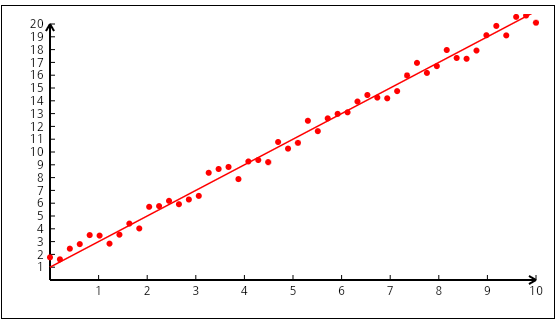
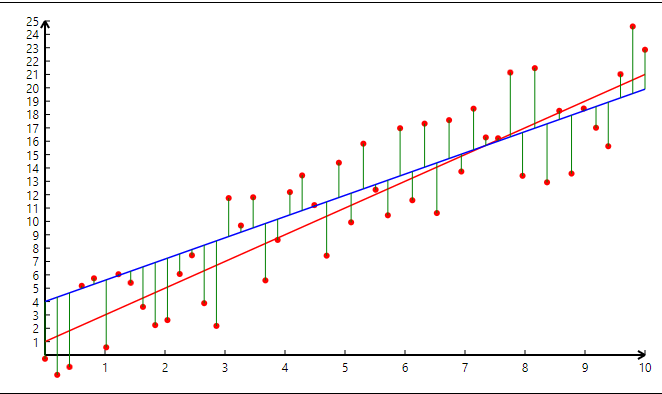
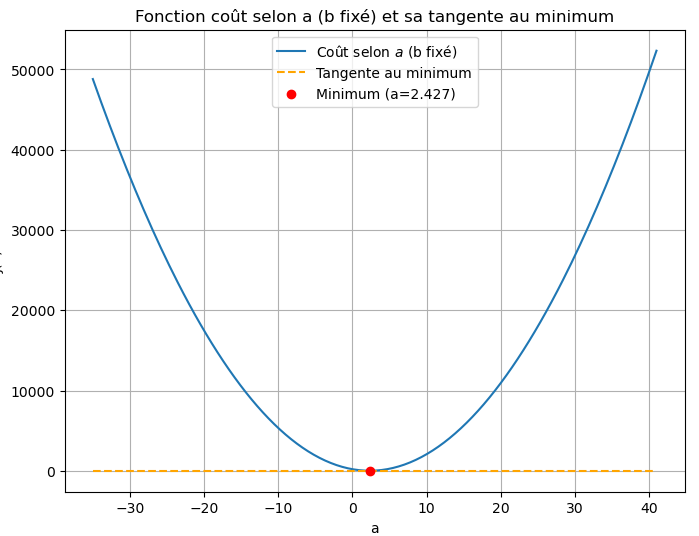
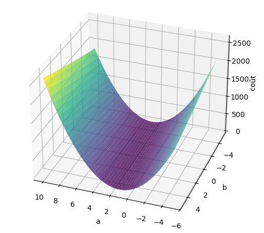
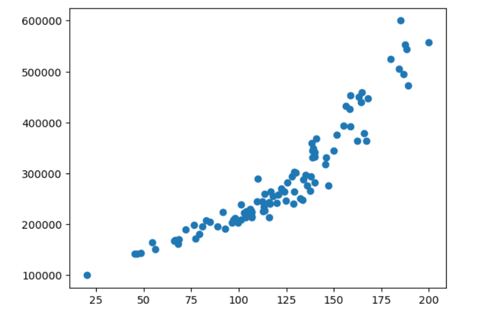
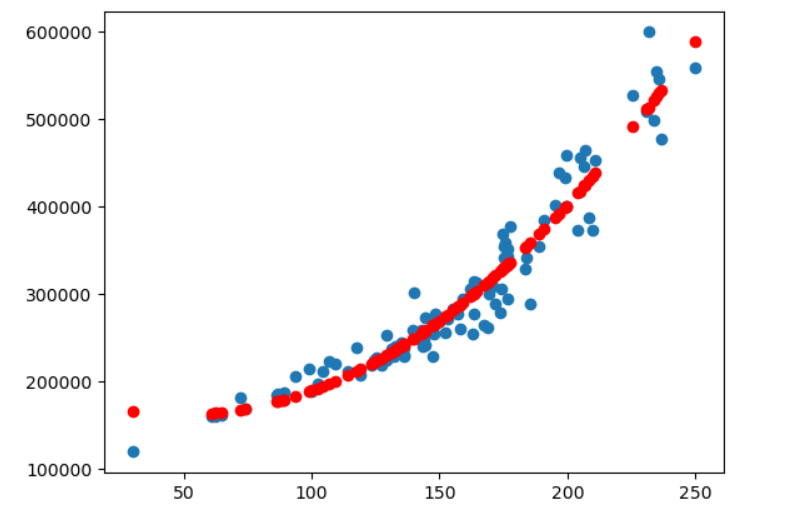

# Régression linéaire et descente du gradient

La **descente du gradient**, c'est un incontournable, la brique de base pour mettre un pied dans l'IA. Tous les tutoriels sur le Machine Learning commencent par là car il est mathématiquement simple à expliquer et **très facile à programmer**.

*D'ailleurs, je me suis amusé à le programmer en C# sans l'aide de l'IA 😄, en utilisant le framework Avalonia qui supporte le WebAssembly (pas en JavaScript donc). C'est sympa, ce Avalonia : ça ressemble comme deux gouttes d'eau à WPF et c'est bien plus performant que Blazor en WebAssembly. Ce n'est pas vraiment le propos ici, j'y reviendrai sur la problématique des frameworks UI dans une autre page.
L'idée était de visualiser la descente du gradient étape par étape, en montrant la convergence vers la solution (il y a un petit souci pour saisir les valeurs sous Android, bug du framework? )

[Une petite régression](smallproject/wwwroot/index.html){: .btn }

La grande majorité des modèles, y compris les réseaux de neurones, ajustent leurs paramètres (poids) en minimisant une fonction de coût grâce à la descente du gradient.

J'aime particulièrement les explications de [Machine Learnia](https://www.youtube.com/watch?v=wg7-roETbbM).

Il y a aussi le cours [Machine Learning d’Andrew Ng](https://lnkd.in/dk-gNabx) en anglais.

Pour des raisons pédagogiques, les données sont souvent très simples : deux informations, y et x, par exemple le prix d'une maison en fonction de sa taille (dans la vraie vie, il y a bien plus de variables : le nombre de pièces, le secteur, la taille du jardin, les travaux...).  
Mais quelle que soit la complexité des données d'entrée, la problématique reste identique : trouver une corrélation entre les données afin de prédire toute valeur de y (cible ou target) à partir des valeurs des variables x (features), tout en minimisant l'erreur de cette prédiction.

Trouver cette corrélation, c'est découvrir un modèle ou une fonction:
$$ 
y = f(x)
$$

qui minimise, en moyenne sur toutes les données observées (x, y), la différence entre le y prédit f(x) et le y observé.

On peut imaginer différentes fonctions (continues, non continues avec des seuils, linéaires, quadratiques, polynomiales), mais il faut éviter des modèles trop complexes qui risquent de "sur-apprendre" et de mal prédire ensuite. Cela fait justement partie du métier du Data Scientist de trouver le modèle le plus approprié, en le testant avec un échantillon de données réservées à cela.

Le modèle le plus simple par lequel il faut commencer, c'est la droite, fonction affine entre x et y. Il s'agit d'un **modèle de régression linéaire** :
$$
y = a x + b
$$

Mais attention, ce n'est pas parce que c'est une droite qu'on parle systématiquement de régression linéaire. C'est suffisant, mais pas nécessaire : ce qui caractérise une régression linéaire, c'est le fait que la formule est une combinaison linéaire des paramètres a et b : chaque paramètre apparaît au premier degré (pas de carré, de produit non-linéaire, de fonction trigonométrique, etc).

Et cela est vrai aussi pour des modèles plus complexes avec plusieurs paramètres (a0, a1, a2, a3), tant que c'est une combinaison linéaire de ces paramètres.

Notre modèle peut donc être un polynôme de degré n (courbe et non droite) :
$$
y = a_0 + a_1 x + a_2 x^2 + a_3 x^3
$$
ou un polynôme à plusieurs variables :
$$
y = a_0 + a_1 x_1 + a_2 x_1^2 + a_3 x_2 + a_4 x_2^2
$$
avec des transformations :
$$
y = a_0 + a_1 \log(x_1) + a_2 \sqrt{x_2}
$$
ou avec interactions entre les variables :
$$
y = a_0 + a_1 x_1 + a_2 x_2 + a_3 x_1 x_2
$$

Cette compréhension est importante car dans certains tutos, les auteurs introduisent la notion de **régression polynomiale** en la distinguant de la régression linéaire construit sur l'exemple d'un modèle de fonction affine. Il s'agit d'un abus de langage! quand ils parlent de régression polynomiale, **il s'agit toujours de régression linéaire mais sur des features polynomiales**. Je trouve que leur explication porte à confusion.

$$
   x \rightarrow (x,x^2,x^3)
$$

Comment mieux définir cette notion de regression linéaire?

On cherche à minimiser la différence entre les y prédits et les y observés. Cette différence s'appelle le coût. Il y a autant de valeurs de coût que de valeurs possibles pour les paramètres, donc une infinité. Il s'agit de trouver la version optimale des valeurs de ces paramètres pour que le coût soit minimal.

Dans le cas le plus courant, on utilise une fonction de coût quadratique appelée erreur quadratique moyenne (Mean Squared Error, MSE). La formule est explicitée plus loin.
**Lorsque le modèle est linéaire en paramètres, cette fonction de coût est convexe, ce qui garantit l’existence d’un minimum global unique.**

Dès que les paramètres interviennent de manière non-linéaire (par exemple sous forme de produit, exposant variable, ou dans une fonction non-linéaire comme sinus/cosinus), la fonction de coût n'est plus convexe et le problème n'est plus une régression linéaire :

- $ y = a x_1^{b} $   paramétres a et b
- $ y = a_0 + \sin(a_1 x_1) $
- $ y = a_1^2 x_1 + a_1 $
- $ y= a_1^2 x_1 $ (peut se transformer en $ b_1= a_1^2 $ : alors le modèle est linéaire en $ b_1 $, à condition que la valeur trouvée pour $ b_1 $ soit positive à la fin)

Pour revenir à notre modèle très simple, il s'agit donc d'une droite $$ a x + b $$ ( et on verra que ce n'est pas plus compliqué à résoudre avec plus de variables ou de degrés).  
Le problème devient : sachant qu'on a un ensemble de couples (x, y), comment trouver les paramètres a (pente) et b (ordonnée à l'origine) de la fonction 
$$
f(x) = a x + b
$$
qui font que la distance entre f(x) et y soit en moyenne la plus petite possible.  
Pour éviter les valeurs négatives, on élève au carré (on aurait pu choisir la valeur absolue) d'où le degré 2! 

Évidemment, si on a plusieurs variables, ce n'est plus une droite mais un hyperplan, et le calcul matriciel est plus simple pour exprimer et trouver ce minimum d'erreur sur les paramètres de l'équation :

$$
f(x_1, x_2, x_3) = a x_1 + b x_2 + c x_3 + d
$$

- Écriture scalaire

$$
\tilde x =
\begin{pmatrix}
x_1 \\
x_2 \\
x_3 \\
1
\end{pmatrix}
$$

$$
\Theta =
\begin{pmatrix}
a \\
b \\
c \\
d
\end{pmatrix}
$$

$$
f(x_1, x_2, x_3) = \tilde x^{\,T} \,\Theta
$$

- Écriture matricielle avec N données d'entrée

$$
X =
\begin{pmatrix}
x_{11} & x_{12}& x_{13} & 1 \\
x_{21} & x_{22} & x_{23} & 1 \\
\vdots & \vdots & \vdots & \vdots \\
x_{N1} & x_{N2} & x_{N3} & 1
\end{pmatrix}
$$

$$
\Theta =
\begin{pmatrix}
a \\
b \\
c \\
d
\end{pmatrix}
$$

Le modèle devient :

$$
\hat y = X\Theta
$$

$$
X \in \mathbb{R}^{N \times 4} \quad \Theta \in \mathbb{R}^{4 \times 1} \quad \hat y \in \mathbb{R}^{N \times 1}
$$

C'est là où la programmation, quel que soit le langage (Python ou C#), devra utiliser une librairie de calcul matriciel.

Mais revenons à notre problématique à une variable !
On cherche à minimiser les distances affichées en vert sur le graphique. Il s'agit de trouver le meilleur compromis. En machine learning, on parle de coût.

La fonction de coût est définie par la moyenne des distances euclidiennes entre chaque point observé $$ y_i $$ et son point de prédiction $$ F(x_i) $$ : 

$$
d = \sqrt{(x_2 - x_1)^2 + (y_2 - y_1)^2}
$$

On compare suivant une projection sur l'axe des y — on prend alors $$ x_2 = x_1 $$ et on retire la racine car ça complique inutilement:

$$
C_{(a,b)} (x_2) = (y_2 - y_1)^2
$$

La moyenne pour tous les points observés est donc :
$$
J_{(a,b)} = \frac{1}{N} \sum_{i=1}^{N} (a x_i + b - y_i)^2
$$

Pour simplifier les dérivées, on rajoute un facteur $$ \tfrac12 $$ ; l'essentiel étant de comparer des choses comparables. On peut ajouter tout facteur à cette fonction de coût :

$$
J(a,b) = \frac{1}{2N} \sum_{i=1}^{N} (a x_i + b - y_i)^2
$$

On se retrouve ainsi avec une fonction quadratique à deux variables $$ a $$ et $$ b $$.

Il s'agit maintenant de trouver le point minimum de cette fonction de coût quadratique :  
une parabole selon $$ a $$ en fixant $$ b $$, et aussi une parabole selon $$ b $$ en fixant $$ a $$.

Ou, dans le cas simple de deux paramètres $$ a $$ et $$ b $$, le fond de la cuvette 😉!

Pour trouver le minimum de chaque parabole, il faut se replonger dans [les cours de lycée](../math/Mathématiques%20joyeuses.md) !

On cherche la tangente à chaque courbe qui a une pente nulle.  
Pour cela, il faut calculer la dérivée en fonction de $$ a $$ en fixant $$ b $$, et réciproquement, la dérivée en fonction de $$ b $$ en fixant $$ a $$.  
On les appelle **dérivées partielles**, et le **gradient** est le vecteur constitué de ces deux dérivées :
$$
\nabla J(a,b) =
\begin{pmatrix}
\frac{\partial J}{\partial a} \\
\frac{\partial J}{\partial b}
\end{pmatrix}
$$

C'est là qu'il faut revoir un peu la formule de dérivation de fonction composée :

$$ 
(g \circ f)' = f' \, g'(f)
$$

- Dérivée partielle par rapport à $a$ :

$$
\frac{\partial J}{\partial a}
= \frac{1}{N} \sum_{i=1}^{N} (a x_i + b - y_i)\, x_i
$$

- Dérivée partielle par rapport à $b$ :

$$
\frac{\partial J}{\partial b}
= \frac{1}{N} \sum_{i=1}^{N} (a x_i + b - y_i)
$$

Ensuite, deux options : soit on utilise la méthode analytique (méthode des moindres carrés) en résolvant directement
$$
\nabla J(a,b) =
\begin{pmatrix}
0 \\
0
\end{pmatrix}
$$

soit on utilise la fameuse descente du gradient — où l'on va faire converger les paramètres vers ce minimum du coût. On verra plus loin dans quels cas cette seconde méthode est plus appropriée.

## Méthode analytique

Continuons donc la méthode analytique, ce qui donne le système de deux équations :

$$
\sum_{i=1}^{N} (a x_i + b - y_i) = 0
$$
$$
\sum_{i=1}^{N} (a x_i + b - y_i)\, x_i = 0
$$

Résolution (formules un peu lourdes ! mais ça marche directement) :

$$
b = \frac{\sum_{i=1}^{N} y_i - a \sum_{i=1}^{N} x_i}{N}
$$

$$
a =
\frac{
N \sum_{i=1}^{N} x_i y_i
- \left(\sum_{i=1}^{N} x_i\right)
  \left(\sum_{i=1}^{N} y_i\right)
}{
N \sum_{i=1}^{N} x_i^2
- \left(\sum_{i=1}^{N} x_i\right)^2
}
$$

**Avec les matrices, c'est beaucoup plus simple !**

Exprimons cela sous forme matricielle :

On définit :

$$
X =
\begin{pmatrix}
x_1 & 1 \\
x_2 & 1 \\
\vdots & \vdots \\
x_N & 1
\end{pmatrix}
$$

$$
\Theta =
\begin{pmatrix}
a \\
b
\end{pmatrix}
$$

$$
Y =
\begin{pmatrix}
y_1 \\
y_2 \\
\vdots \\
y_N
\end{pmatrix}
$$

Le modèle s’écrit alors :

$$
F = X \Theta
$$

La fonction de coût quadratique moyenne est :

$$
J(\Theta) = \frac{1}{2N} \|X \Theta - Y\|^2
$$

où $$ \|\cdot\| $$ désigne la norme euclidienne.
Des tutoriaux utilisent le signe Somme sur un vecteur au carré. Je ne suis pas certain que l'écriture soit mathématiquement valide mais elle reste compréhensible:

$$
J(\Theta) = \frac{1}{2N} \sum (X \Theta - Y)^2
$$

Il est cependant plus rigoureux de faire apparaitre l'indice.

$$
J(\Theta) = \frac{1}{2N} \sum_{i=1}^N \left[ (X\Theta)_i - Y_i \right]^2
$$

Quant au gradient de cette fonction de coût :

$$
\nabla J(\Theta) = \frac{1}{N} X^T (X \Theta - Y)
$$

D'où vient le $$ X^T $$ ? 

Eh bien, il suffit de regarder ce qu'est le vecteur $$ \nabla J(\Theta) $$ :

$$
\nabla J(\Theta) = 
\begin{pmatrix}
\frac{1}{N} \sum x_i (a x_i + b - y_i) \\
\frac{1}{N} \sum 1 \cdot (a x_i + b - y_i)
\end{pmatrix}
$$

On voit que la matrice $$ X^T $$ est :

$$
\begin{pmatrix}
x_1 & x_2 & \dots & x_N \\
1 & 1 & \dots & 1
\end{pmatrix}
$$

et qu'en multipliant la matrice transposée à $$ (X\Theta - Y) $$ on a bien un vecteur qui contient les sommes.

Rappel : pour une matrice $$ A(N \times 2) $$, $$ B(2 \times M) $$, $$ C(N \times M) $$

$$
A =
\begin{pmatrix}
a_{11} & a_{12} \\
a_{21} & a_{22} \\
\vdots & \vdots \\
a_{N1} & a_{N2}
\end{pmatrix}, \quad
B =
\begin{pmatrix}
b_{11} & b_{12} & \dots & b_{1M} \\
b_{21} & b_{22} & \dots & b_{2M}
\end{pmatrix}
$$

$$
C = AB =
\begin{pmatrix}
a_{11} b_{11} + a_{12} b_{21} & a_{11} b_{12} + a_{12} b_{22} & \dots & a_{11} b_{1M} + a_{12} b_{2M} \\
a_{21} b_{11} + a_{22} b_{21} & a_{21} b_{12} + a_{22} b_{22} & \dots & a_{21} b_{1M} + a_{22} b_{2M} \\
\vdots & \vdots & \ddots & \vdots \\
a_{N1} b_{11} + a_{N2} b_{21} & a_{N1} b_{12} + a_{N2} b_{22} & \dots & a_{N1} b_{1M} + a_{N2} b_{2M}
\end{pmatrix}
$$

Donc, si on revient à la résolution analytique, chercher le vecteur $$ \Theta $$ contenant les paramètres a et b consiste à résoudre :

$$
\nabla J(\Theta) = 0
$$

Ce qui donne :

$$
X^T X \Theta = X^T Y
$$

Si $$ X^TX $$ est inversible, on obtient la solution analytique :

$$
\boxed{
\Theta = (X^TX)^{-1}X^TY
}
$$

*Et ce qui est génial avec cette formule, c'est qu'elle est valable pour tout modèle de régression linéaire,  
quel que soit le nombre de variables et la forme des variables* :

$$
y = a_0 + a_1 x_1 + a_2 x_1^2 + a_3 x_2 + a_4 x_2^2 + a_5 x_1 x_2
$$

$$
F =
\begin{pmatrix}
1 & x_{11} & x_{11}^2 & x_{12} & x_{12}^2 & x_{11} x_{12} \\
1 & x_{21} & x_{21}^2 & x_{22} & x_{22}^2 & x_{21} x_{22} \\
\vdots & \vdots & \vdots & \vdots & \vdots & \vdots \\
1 & x_{N1} & x_{N1}^2 & x_{N2} & x_{N2}^2 & x_{N1} x_{N2}
\end{pmatrix}
\begin{pmatrix}
a_0 \\ a_1 \\ a_2 \\ a_3 \\ a_4 \\ a_5
\end{pmatrix}
$$

Par exemple, imaginons qu'on ait des données pour lesquelles un modèle polynomial est plus approprié (le prix de la maison s'envolant passé une certaine taille).

On voit que les données suivent plus une courbe qu'une droite.
On va tenter un modèle de type :
$$
f(x) = a_0 + a_1 x + a_2 x^2
$$

On aura :
$$
F =
\begin{pmatrix}
1 & x_1 & x_1^2 \\
1 & x_2 & x_2^2 \\
\vdots & \vdots & \vdots \\
1 & x_N & x_N^2
\end{pmatrix}
\begin{pmatrix}
a_0 \\ a_1 \\ a_2
\end{pmatrix}
$$

et trouver les valeurs a0, a1, a2 avec la même formule.

De même, si on a plusieurs variables, deux dans l'exemple qui suit :
$$
f(x_1, x_2) = a_0 + a_1 x_1 + a_2 x_2
$$

On aura :
$$
F =
\begin{pmatrix}
1 & x_{11} & x_{12} \\
1 & x_{21} & x_{22} \\
\vdots & \vdots & \vdots \\
1 & x_{N1} & x_{N2}
\end{pmatrix}
\begin{pmatrix}
a_0 \\ a_1 \\ a_2
\end{pmatrix}
$$

Et après application de la formule magique, on trouve les paramètres de l'équation.  
On peut encore représenter les données, même si ça devient compliqué de voir la qualité de la prédiction suivant chaque variable.

  <iframe src="2variables.html" width="100%" height="500" style="border:none;display:block;"></iframe>

---

**Il y a juste un petit problème.  
L’inversion de la matrice $$ X^T X $$ a un coût algorithmique :**

$$
\mathcal{O}(d^3)
$$

et nécessite de stocker (en mémoire) :

$$
\mathcal{O}(d^2)
$$

Pour un très grand nombre de variables, 1 million par exemple, ce n'est même pas envisageable !  
On dispose d'une autre méthode adaptée à ce genre de cas : la descente du gradient.

---

## La fameuse descente du gradient

Plus haut, je montrais le graphique de la cuvette. L'objectif est de descendre au fond de cette cuvette.  
Bon, l'image de la descente d'une montagne vers le bas de la vallée est plus bucolique, je vous l'accorde 😄.

On va suivre la pente de la montagne ! Et la pente, c'est le calcul de la dérivée.  
Si elle est négative, on descend donc on avance dans la bonne direction,  
si elle est positive, on monte, donc il faut revenir sur ses pas.  
Imaginez maintenant qu'on fasse cela les yeux bandés : le meilleur moyen, c'est de sentir la descente et la montée en faisant des petits pas.  
S'ils sont trop grands (on a mis des bottes de 7 lieux 😉), on risque de passer de l'autre côté de la vallée ; s'ils sont trop petits, la soupe aura le temps de refroidir !

Heureusement, dans notre problématique de régression linéaire, il n'y a qu'un seul fond de vallée :  
on ne risque pas de se tromper de village !

Si on exprime cela sous forme mathématique :

À chaque itération $$ t $$ :

$$
\begin{cases}
a^{(t+1)} = a^{(t)} - \alpha \dfrac{\partial J}{\partial a} \\
b^{(t+1)} = b^{(t)} - \alpha \dfrac{\partial J}{\partial b}
\end{cases}
$$

où 
$$
\alpha > 0
$$ 
est le **learning rate** (il permet d'ajuster la longueur de nos pas).

---

Les équations de la descente de gradient deviennent :

$$
a \leftarrow a
- \alpha \frac{1}{N} \sum_{i=1}^{N} (a x_i + b - y_i)\, x_i
$$

$$
b \leftarrow b
- \alpha \frac{1}{N} \sum_{i=1}^{N} (a x_i + b - y_i)
$$

On part d'un $$ a $$ et $$ b $$ au hasard et on applique les formules.
Ces mises à jour sur $$ a $$ et $$ b $$ sont répétées jusqu’à convergence des dérivées vers la valeur 0 (pente de la tangente = 0).

- Le pas 
$$
-\nabla J
$$
ajuste les paramètres dans la direction opposée à la pente, vers le minimum de la fonction de coût.

- Le learning rate contrôle la vitesse de convergence et doit être choisi avec soin (il faut parfois ajuster plusieurs fois sa valeur pour trouver le bon compromis entre rapidité et stabilité) :
  - trop grand -> divergence (la fameuse oscillation sans fin)
  - trop petit -> convergence lente (la soupe refroidit !)

On peut arrêter l’algorithme lorsque :

$$
\|\nabla J(a,b)\| < \varepsilon
$$

ou lorsqu'un nombre d’itérations fixé est atteint.

De la même manière que pour la formule magique de la méthode analytique, s'il y a plusieurs variables ou plusieurs degrés de variable, la descente de gradient peut s'exprimer sous forme matricielle afin de calculer plus facilement toutes les dérivées partielles (et ça se programme comme un petit bonheur en Python !) :

$$
\Theta \leftarrow \Theta - \alpha \nabla J(\Theta)
$$

ou, autre manière d'écrire :

$$
\Theta \leftarrow \Theta - \alpha \frac {\partial J}{\partial \Theta}
$$

avec 

$$
\nabla J(\Theta) = \frac{1}{N} X^T (X \Theta - Y)
$$

Et là, pas besoin d’inverser une grosse matrice : 
quelques multiplications, additions et une transposée suffisent, même quand le nombre de variables explose !
