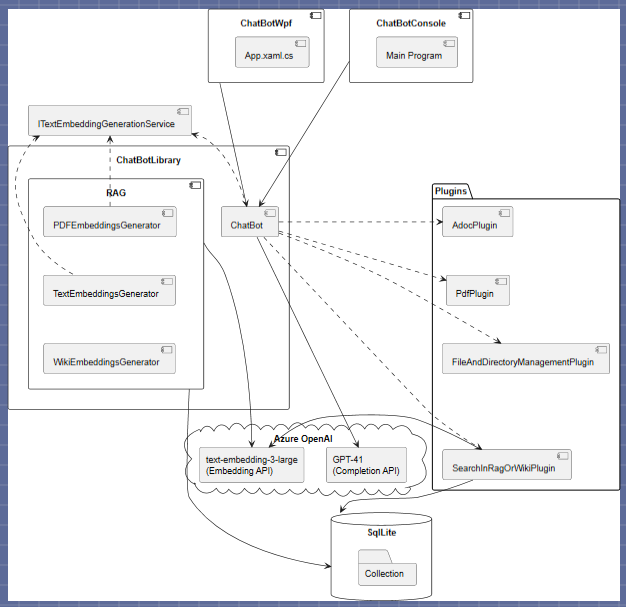

# Patbot et Rag la casquette !

J'expliquais dans l'article [mamma mia](mamma mia.html) le travail et le bénéfice d'avoir mis en place un chatbot maison enrichi par une base de données RAG.  Je propose d'apporter quelques détails, sachant qu'il a été développé en c# avec le framework SemanticKernel mais que je suis en train de réécrire un équivalent pour un usage personnel et pour qui n'en veut 😉 en utilisant le remplaçant de SemanticKernel: Microsoft Agent Framework et Avalonia (WPF multi-plateforme).

Mais revenons au travail initial... 

**Tout d'abord, j'ai compris le point le plus important** : toute la conversation est envoyée systématiquement au LLM ; il n'a aucune mémoire liée à une session quelconque. Si, à chaque question, on n'envoie pas ce qui s'est dit auparavant, la conversation devient très vite un dialogue de sourds. Le second point est la possibilité de mettre ce qu'on veut, par programmation j'entends, dans le contexte avant de l'envoyer. C'est ainsi qu'on peut compléter le prompt, donner des instructions de réponse, ajouter de la connaissance sans que l'utilisateur ne le sache ni ne le voit. Par contre, c'est là que les LLM peuvent montrer des limitations indiquées par le nombre de tokens acceptés et que le développeur peut user d'astuces pour tenter de compresser au maximum ce contexte (par exemple, en utilisant préalablement une question au LLM qui restera caché pour l'utilisateur: « Fais-moi un résumé du contexte en X mots ») ou retirer les parties les plus anciennes.

Ensuite, avec cette notion de **plugin**, on dispose du moyen de transformer le chatbot en agent capable de réaliser des actions (par exemple : lire ou créer un fichier, rechercher dans une base de données, dans un RAG, sur Internet, envoyer un mail, etc.). Des fonctions sont codées et injectées via le framework dans le contexte du prompt (non visible pour l’utilisateur) à travers une description précise et courte (fourni dans un méta-attribut de la fonction ou plutôt méthode en C#). Sur cette base, certains LLMs (pas tous, a priori) ont été entraînés pour générer une réponse contenant une codification précise correspondant à une des fonctions : celle-ci est interceptée par le framework Semantic Kernel, qui appellera alors la fonction en question. Il faut être très vigilant à définir les fonctions de manière unique (pas seulement le nom, mais aussi la sémantique de la description) pour éviter les télescopages (une fonction appelée à la place d’une autre).

Pour un développeur, voilà une belle opportunité d’enrichir l’interface homme-machine de son logiciel, qui pourra effectuer des opérations pilotées par des instructions en langage naturel (et même par la voix, si on utilise un système de reconnaissance vocale).  
Une autre possibilité consiste à mettre en place des multi-agents, des microservices recevant des instructions, opérant un certain nombre d’actions puis envoyant le résultat à un autre agent. Voilà de quoi mettre en place des architectures selon les patterns éprouvés de faible couplage et forte cohésion, basées sur des dialogues et de l’enrichissement de contexte inter-agent.  

Petite parenthèse, dans l’esprit des plugins Semantic Kernel mais dépassant l’écosystème .Net, un protocole standard a été introduit : MCP (Model Context Protocol), qui permet d’enrichir les actions des LLMs en appelant des serveurs MCP (un programme qui est lancé et qui renvoit du texte sur la sortie standard)) fournissant des informations qui vont enrichir le contexte, puis relancer le travail du LLM sur la base de ce nouveau contexte.

**Mais la vraie plus-value de ce chatbot a été la mise en place d’un RAG**. Le RAG, c’est une base de données de texte issus de documents (convertis en texte), que l’on découpe en morceaux (ni trop petits, ni trop grands, c’est toute la difficulté). Chaque morceau est transformé en un vecteur sémantique (embedding vector, obtenu via un réseau de neuronne propre aux LLMs nommé *transformer*). Quand une question est posée, on la transforme de la même manière en vecteur sémantique . Ensuite, avec une opération mathématique assez triviale (calcul de similarité cosinus), on calcule la proximité de ce vecteur "prompt" avec tout ceux du RAG (ce qui revient à rechercher les morceaux sémantiquement proches, donc en lien avec le sujet de la question, et ceci indépendamment de la langue!). 

Le gros intêret du Rag est qu'on n'a pas besoin de 'fine-tuner' nous même un modèle LLM, ce qui demande des milliers d'heures de calcul.
On se contente d'ajouter des morceaux de texte au contexte du prompt. Bien entendu, il faut mettre en place une heuristique pour éviter de submerger le contexte de trop d'information (on peut définir un niveau de pertinance en jouant sur le coefficient de similarité des vecteurs, on peut limiter le nombre de morceau trouvé, etc..), c'est une des limitations par rapport à un modèle "fine-tuné" à partir d'un corpus de documents sépcifiques.

Un aspect concluant a été d’ajouter le nom de la source (et la page, pour des documents pdf ou office) à chaque morceau de texte, offrant ainsi à l’utilisateur la possibilité d’ouvrir le document à la bonne page à sa demande auprès du LLM via ... un plugin dédié : opendocument(source,page) !

Le plus fort, c'est que la recherche dans le RAG elle même était faite via un pluggin. On trouve beaucoup d'exemples qui partent de la question de l'utilisateur pour aller rechercher les morceaux en lien dans le RAG .Mais si la question est juste "Combien font 2 +2", c'est une perte de temps et de ressources. Par contre, via une fonction bien décrite, "SearchInRaG( summaryOfContext )" en endiquant le thème du RAG,  on laisse le LLM le choix ou non d'aller rechercher de l'information en fournissant un résumé du contexte le plus pertinant!  Le résultat a été très satisfaisant même si parfois il faut que l'utilisateur se montre un peu insistant pour que la recherche se déclenche - ex: "tu es sur d'être sur de ne rien trouver ?" 😄 -. 

*Le chatbot mis en place est donc une application .NET utilisant une base de données et un service LLM distant sur Azure (ou en local). Nous avons ensuite mis en place différentes stratégies de déploiement : local (mono-utilisateur), web (multi-utilisateur), base de données locale ou distante, déploiement local ou distant via conteneur Docker, etc.  toutes ses problèmatiques d'architecture en fonction des besoins utilisateurs restant classique et, surtout, n'ayant rien à voir avec l'IA.*

Diagramme des composants pour un déploiement local:

