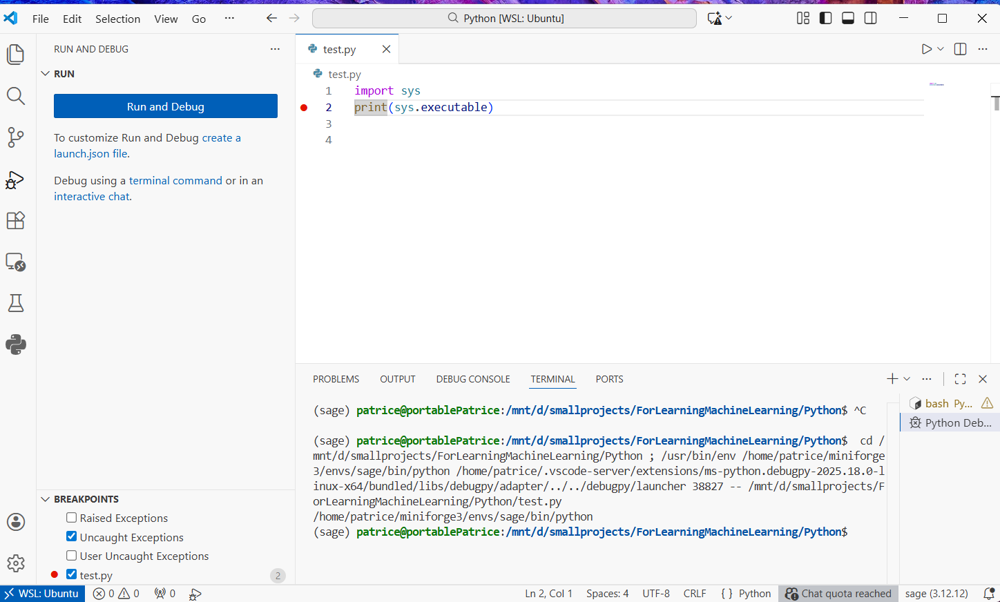

# Pense-bête-Python!

Lors de ma carrière, j'ai travaillé essentiellement avec les langages C, C++ (principalement en utilisant l'écosystème MFC de Microsoft mais aussi les STL), et surtout .NET avec C# (framework 3→4.8 ainsi que la version multiplateforme et open source .NET Core → .NET 10.0). Bien entendu, pendant les études, de nombreux langages ont été très formateurs : Basic, Pascal, Ada, SmallTalk, Lisp, Prolog. 
Je n'oublie pas non plus les langages 'systèmes', Ruby (via le DevOps Chef) et PowerShell (que je n'aime pas trop mais qui est un peu obligé sous Windows car bien intégré), ni les langages Web, JavaScript, TypeScript et leurs quantités impressionnantes de frameworks graphiques (D3.js, mxgraph pour avoir joué avec). Java est un peu à part car on aurait pu l'adopter complètement dans l'entreprise mais le choix a été supplanté par C#, cohérence autour des outils Microsoft oblige.

Par contre, je n’avais jamais eu l’occasion de pratiquer Python ; voilà donc l’opportunité, d’autant plus qu’il s’impose clairement comme le langage de référence pour l’IA.

Côté .NET, il existait il y a quelques années Accord.NET, mais le projet ne semble plus vraiment maintenu. Aujourd’hui, si l’on souhaite travailler en .NET, il faut plutôt se tourner vers ML.NET, éventuellement combiné à Math.NET pour la manipulation de matrices et le calcul numérique. On aurait pu imaginer aussi que, couplé à F#, orienté scientifique, on avait là le trio gagnant sur lequel miser notre effort (cela dépend aussi du cœur de métier et de la culture d'entreprise).
Mais c'est toujours Python qui reste au devant de la scène. Est-ce une question de timing — un peu comme JavaScript, qui peine à être totalement supplanté par TypeScript — ou bien une image trop fortement associée à Microsoft ?

Bref, maîtriser Python semble donc aujourd’hui incontournable, et il n’est de toute façon jamais inutile de se former à un nouveau langage. D’autres mériteraient aussi que je m’y intéresse à l’occasion — Rust, Go — mais évitons de trop nous disperser : c’est bien souvent le danger.

## Installation

Dans les vidéos [Machine Learnias](https://www.youtube.com/watch?v=8GBzamEdMOI), le formateur conseille d'installer [Anaconda](https://www.anaconda.com/download), qui permet d'avoir tout l'environnement nécessaire (Python, packages, outils) très facilement sans se poser de questions.

Mais il se trouve que j'avais installé SageMath sur une distribution Ubuntu tournant sous le WSL de Windows 11. J'avais suivi ce [tutorial](https://doc.sagemath.org/html/en/installation/conda.html). Sage se base sur Python et sur le même écosystème que propose Anaconda, un ensemble de packages pour le calcul scientifique et pour l'IA.
En fait, en suivant le tutoriel, j'ai installé Miniforge qui fournit le minimum d'outils et de packages nécessaires mais qu'on peut étendre au fur et à mesure des besoins.

### Miniforge
Donc le point d'entrée, c'est Miniforge :
```bash
curl -L -O "https://github.com/conda-forge/miniforge/releases/latest/download/Miniforge3-$(uname)-$(uname -m).sh"
bash Miniforge3-$(uname)-$(uname -m).sh
```

### Conda

L'outil de base est conda. C'est le gestionnaire de packages scientifiques (l'équivalent de npm pour node.js ou du gestionnaire NuGet de .NET).
Notons que Python a son propre gestionnaire de packages : pip, mais c'est plus général et ça ne contient pas nécessairement les packages scientifiques utilisés pour l'IA. 
Quoique... parfois pip a la préférence pour obtenir certains packages plus à jour.

```bash
pip torch tensorflow 
```

Pour installer un package, il suffit d'utiliser l'instruction install :

```bash
conda install numpy 
conda install pandas matplotlib seaborn scikit-learn
```

On peut spécifier différents dépôts de packages : Anaconda ou conda-forge.

Avec Miniforge, conda-forge est configuré par défaut mais si ce n’était pas le cas (si on avait installé Anaconda par exemple), voici ce qu'on pourrait faire :

```bash
conda config --add channels conda-forge
```
ou le spécifier au moment d’installer un package :

```bash
conda install -c conda-forge numpy
```

Conda fournit la notion d'environnement (en fait, il configure les variables d'environnement de Linux, un peu comme Docker mais en beaucoup moins poussé). Il faut aussi savoir que Python a sa propre notion d'environnement venv. Si j'ai bien compris, Conda utilise venv afin de permettre une isolation entre les différentes installations de packages.
En suivant le tutoriel d'installation de SageMath, le fait de lancer `conda create -n sage sage` a créé un environnement Sage.
Mais on peut créer d'autres environnements et switcher de l'un à l'autre via la commande activate :

```bash
conda activate sage
```
Tout ce que j’installe maintenant va dans */home/patrice/miniforge3/envs/sage*

Pour avoir la liste des environnements, il faut taper l'instruction suivante :

```bash
conda env list
```

J'obtiens :

```bash
# conda environments:
#
# * -> active
# + -> frozen
base                     /home/patrice/miniforge3
sage                 *   /home/patrice/miniforge3/envs/sage
```

Il faut faire attention car Python est installé à deux endroits : dans base et dans sage.

Pour s'en rendre compte :

```Python test.py
import sys
print(sys.executable)
```

```bash
conda activate base
python test.py
/home/patrice/miniforge3/bin/python

conda activate sage
python test.py
/home/patrice/miniforge3/envs/sage/bin/python

```

### Les éditeurs

J'ai essayé les 3 outils :

#### Jupyter

**Jupyter Notebook** est une interface interactive basée sur le navigateur.
On retrouve son utilisation dans plusieurs tutoriels, par exemple [coursera machine learning](https://www.coursera.org/learn/machine-learning/). Cela semble idéal pour l'apprentissage car le fichier contient des cellules contenant du markdown pour les explications ou directement du Python exécutable.

En local, je le lance via sage :

```bash
./sage -n jupyter
```

ou 
```bash
jupyter notebook
```

Jupyter a la notion de Kernel : 

- Jupyter = serveur + interface
- Kernel = moteur d’exécution

Dans mon cas, j'ai deux kernels :

- Python (sage)
- SageMath

---

#### Spyder

**Spyder** est un IDE scientifique, proche de MATLAB.

Un peu comme Visual Studio Code, c'est un éditeur de code avec une console interactive et permettant de déboguer.

Spyder doit être installé dans l’environnement conda.

```bash
conda activate sage
conda install spyder
spyder
```
Ce qui est génial avec Windows 11, c'est que le code s'exécute dans WSL mais l'interface dans Windows. Windows 11 propose nativement un serveur X-Window ! 


#### Visual Studio Code

Je connais mieux cet éditeur donc il a ma préférence. Il tourne sous Windows mais on peut installer une extension Remote-WSL afin d'utiliser le Python installé via Miniforge. Cela évite d'installer un Python sous Windows.
Il faut ensuite se connecter sur le WSL. Idem, il y a une sorte d'isolation entre les extensions installées pour le VSCode connecté à Windows et celui connecté à WSL Ubuntu.  
Par exemple, pour pouvoir déboguer un script, j'ai du installer l'extension Python de Microsoft. J'étais connecté à WSL pour cette installation, et bien, une fois revenu sur Windows, la même extension doit être à nouveau installé si je veux lancer le même script mais avec une version de Python sous Windows.

Revenons à VSCode connecté à Ubuntu. 
J'ai eu une drôle de surprise en faisant Ctrl + Shift + P puis Python: Select Interpreter. 

4 versions d'interpréteur Python ! 

| Emplacement                                     | Rôle / Explication                                                                                                           |
| ----------------------------------------------- | ---------------------------------------------------------------------------------------------------------------------------- |
| `/bin/python`                                   | Python système “très basique” → utilisé par Linux pour les scripts essentiels et très tôt au démarrage                       |
| `/usr/bin/python`                               | Python système principal → la plupart des paquets Linux s’installent ici via `apt`                                           |
| `/home/patrice/miniforge3/bin/python`           | Python de **Miniforge `base`** → installé avec Miniforge, sert à conda lui-même et à exécuter des scripts hors environnement |
| `/home/patrice/miniforge3/envs/sage/bin/python` | Python de **l'environnement `sage`** → celui que je veux utiliser pour le ML et Sage                                       |



**Ouf ! je vais pouvoir commencer à écrire du Python !**

---
