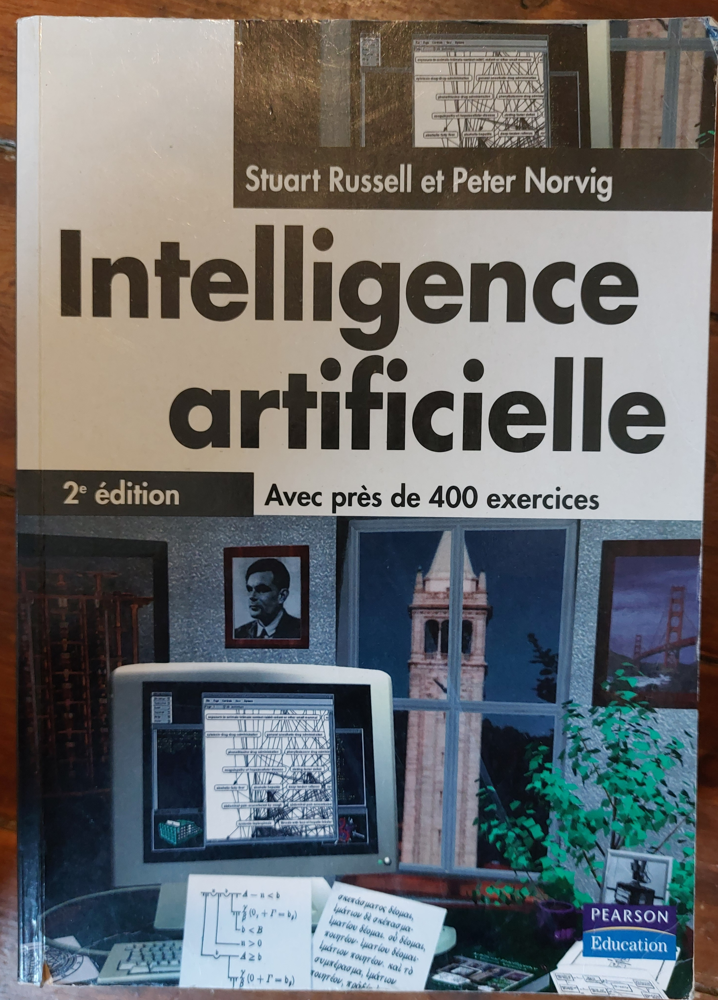

# Mamma mia !

## Les débuts...

J’ai commencé à développer assez tôt, en classe de 4ᵉ. J’avais réussi à convaincre mes parents de nous offrir, à mon frérot Vincent et à moi-même, un ordinateur. J’avais déjà un jeu d’échecs électronique avec lequel je jouais des heures. Mon père, pédagogue et ma mère, prof de français, à force d’arguments et d’enquêtes auprès de leurs collègues - surtout profs de maths😉 -, ont fini par céder. Après tout, c’était mis en avant par l’Éducation nationale — il s’agissait du TO7 😄 — les programmes étaient à visée pédagogique, un peu ludiques, mais rien à voir avec le côté peu créatif des consoles Atari ou des jeux à cristaux liquides que nos cousins possédaient et qui semblaient du point de vue de nos parents bien abrutissants (pas du mien 😉).

Je me souviens avoir passé des heures à restituer les lignes de code contenues dans des livres ou des revues d’informatique (Hebdogiciel). Et déjà, écrire ces lignes de code que l’ordinateur était capable de comprendre et auxquelles il obéissait, c’était comme un dialogue qui s’opérait avec une entité presque vivante, capable de râler “SYNTAX ERROR”, d’éructer avec cette voix stridente lors de la lecture des cassettes, de s’éteindre à la moindre coupure de courant, nous faisant perdre les quelques heures passées à lui donner patiemment des instructions.

Mais je me souviens tout particulièrement d’un article ; c’était dans la revue “Science & Vie”, peut-être en 1985 ou 1986, et ça parlait du fameux test de Turing en donnant un exemple basique de comment programmer une sorte de dialogue avec la machine qui puisse “bluffer” à partir de quelques réponses à des questions toutes faites, préalablement posées par la machine. (Elle nous posait des questions, retenait les réponses puis nous demandait de l’interroger sur ce même champ de questions.) Pas hyper difficile à coder, mais facile à mettre en défaut, facile à déceler la supercherie… en tout cas, ça m’avait bien amusé de coder ça en BASIC sur le TO7 qui commençait déjà à montrer de sérieuses limites.

## Les études ....

Un peu plus tard, lors de mes études, il y a eu la programmation d’un moteur de système expert en projet de maîtrise, d’un mini-compilateur Pascal, l’apprentissage du Prolog, du LISP, des algos minimax, la recherche d’optimum, la théorie des graphes et le fameux problème du voyageur de commerce. Concernant les réseaux de neurones, c’était un peu plus tard, lors de mon DESS à Lille. Mais ça ne faisait qu’effleurer la théorie (en 1995) : perceptron, réseaux multicouches. Un des TPs a consisté à coder une reconnaissance de caractère via un réseau de Hopfield… rigolo, intéressant, mais très limité.

Je m'étais offert la bible mais je n'ai jamais réussi à tout lire ! plus de 1000 pages!

## Le boulot ...

Ensuite, dans le cadre du travail, un système de règles pour la validation des résultats, s’apparentant, en poussant un peu, à une sorte de système expert puis une étude pour utiliser les algorithmes de machine learning (ml.net) afin d'essayer de valider automatiquement des résultats de laboratoire à partir de critères (sexe, âge, résultat du test biologique) en s'affranchissant des bornes de normalité qu'un laboratoire définit en fonction des tests et des populations (enfant, adulte homme, adulte femme et tout les sous ensembles liés à l'âge ). Plus ambitieux, j'ai tenté d'entrainer le model avec des graphes de résultats afin de pouvoir les valider automatiquement. 

C’était dans le cadre d’un hackathon interne, et c’est resté dans les cartons, sacrifié sur l’autel des priorités. Il faut dire que les résultats n’étaient pas non plus hyper concluants : les fameuses règles du système expert étaient bien suffisantes pour arriver au même résultat, les types de variables d’entrée étant plutôt limités. J'avais remarqué d'ailleurs que c'etaient les algorithmes à base d’arbres de décision qui avaient fourni le modèle le plus concluant, les données d'entraînement ayant été labelisés préalablement via le système expert qui est, de par sa nature, un arbre de décision sur des données non séparables lineairement.

eg. if sexe= homme and if age <10y then population=Child

Quant à essayer de valider les résultats sur la base des graphes, je n'avais pas réussi à rassembler suffisamment de graphes d'entraînement pour obtenir des prédictions cohérentes. Et surtout, utiliser la reconnaissance d'image sur des graphes obtenus à partir de quelques points, est-ce vraiment utile ? Autant travailler directement sur la valeur des points...

J’étais donc un peu resté sur ma faim, avec l’idée de reprendre un jour ce sujet et de trouver un domaine d’application plus pertinent. C’est toujours ça la difficulté : il y a plein d’exemples qui tournent parfaitement dans les tutos, mais dès qu’on veut appliquer à nos problématiques métier, ça devient tout de suite beaucoup moins trivial ou moins conluant!

# Cette année là...

Cette année-là, pour moi — 2025 — a été celle de la grande intégration des LLMs suivant deux axes : la mise en place d’outils pour les développeurs (Github Copilot) avec la mesure du fameux ROI pour faire plaisir aux managers qui ont toujours besoin de chiffres et KPIs pour être convaincus. 

- Capacité à pondre des tests unitaires, à expliquer du code, à générer de la documentation de design et des diagrammes UML, et surtout, à produire du code et des exemples d’utilisation de frameworks : la productivité s’en est trouvée accrue, c’est indéniable, mais je reviendrai sur les risques encourus pour notre savoir-faire et notre métier dans d'autres reflexions.

- Plus intéressant, le second axe a consisté à mettre en place un chatbot maison. On voulait que le chatbot puisse utiliser toutes nos documentations pour aider les ingénieurs terrains à configurer, trouver des réponses à des problèmes connus, une sorte de support niveau 1.
On s’est posé la question de l’utilité de développer son propre chatbot plutôt que d’utiliser Microsoft Copilot, GitHub Copilot ou ChatGPT. ChatGPT n’était pas autorisé pour des raisons de sécurité : on ne communique pas d’informations internes à l’extérieur. En revanche, nous avons pu utiliser le moteur GPT-4.1 via les API Azure auxquelles l’entreprise souscrit. J’ai aussi découvert le framework Semantic Kernel de .Net. Deux points ont pu être exploités : la notion de plugin et celle de RAG, cette dernière étant d’ailleurs accessible via la première — j’y reviendrai dans un autre article. 

*Résultat trés gratifiant au final* , même si j'en conviens, nous n'avons fait qu'utiliser les outils et framework fournis par Microsoft. Par contre, on a quand même apporté  de notre créativité avec trois fonctionnalités qui ont été fort bien accueillies et qui, à elles seules, ont justifié ce developpement: la possibilité  à l'utilisateur de demander l'ouverture du document source à la bonne page, la possibilité de noter la qualité de la réponse et la possibilité au responsable de documentation d'alimenter le RAG via l'interface de l'application en tenant en compte les notes et les commentaires des utilisateurs, ce qui est et restera certainement une activité humaine! 
