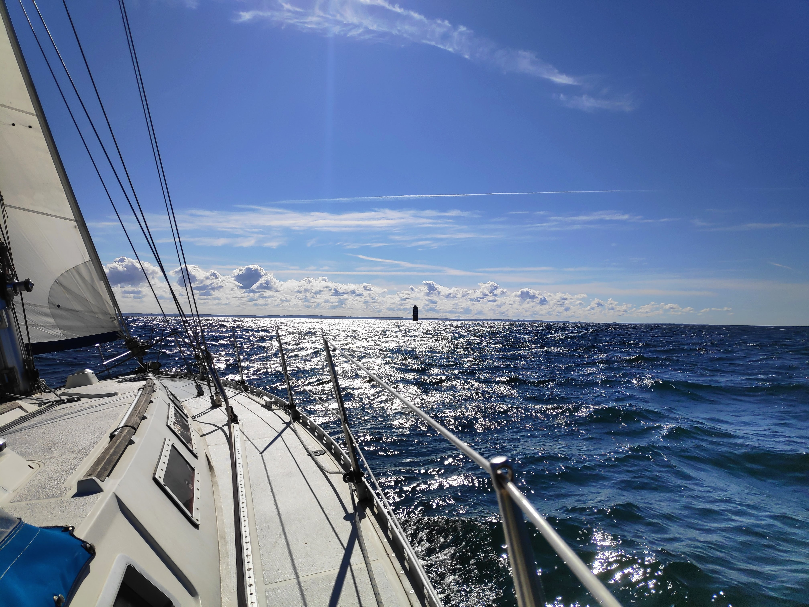

# Définir son cap! 

*Prendre le temps de prendre du temps sans perdre son temps...*

Il y a longtemps que j’avais envie d’écrire un blog… mais je n'avais jamais vraiment réussi à trouver ce fameux temps, entre le travail où l'on “mange” suffisamment d’écrans, la vie de famille, les sports, les lectures, les loisirs !  

Et puis, soudainement, contre toute attente, me voilà en pleine zone d'accalmie, un peu comme les marins traversant l'atlantique et tombant dans le redouté "pôt au noir". Même s'ils peuvent stresser surtout s'il s'agit d'une course au grand large et qu'ils voient les autres concurents avancer sur des routes differentes, prendre son mal en patience est bien la meilleur chose à faire, en profiter pour retrouver des forces avant d'affronter les coûts de vents à venir, réparer le matériel, ranger et organiser leur petit univers de 3 ou 4m2.

Alors, avant qu’une nouvelle île ne se profile à l’horizon et que les vents ne ressoufflent dans la bonne direction, j’entends bien profiter de cette chance pour prendre du recul à travers des synthèses et des réflexions, approfondir divers sujets propres à mon activité d’architecte logiciel, travailler sur de petits projets et, surtout, continuer à progresser.

J’ai choisi, pour le moment, de publier sur Github en utilisant Github Pages, au moins, j’ai le versioning, la sauvegarde et les projets de code pas loin !

Pourquoi ne pas y partager aussi des lectures scientifiques ou littéraires, car j’aime lire, hygiène intellectuelle indispensable face à cette frénésie, ce déferlement d’informations ou d’aphorismes dont nous submerge Internet. 

*Lire pour ralentir...*

Quant à écrire ces pages, ici, c’est surtout un moyen de travailler, de ne pas oublier, de mieux s’approprier les choses, de se donner des objectifs et des contraintes de résultat. Il n’y a pas d’effort sans réconfort mais, réciproquement, il n’y a pas de réconfort sans effort… pour continuer à rester fort (ça, c’est surtout pour la rime 😉), car oui, comme en sport, l’effort intellectuel a son adrénaline, source de plaisir.

Je me fixe pour l’instant **trois caps.**  
[**Le premier**](Architecture logicielle/presentation) est de proposer une synthèse de mes experiences et explorations sur **le développement et l'architecture**. 

[**Mon second cap**](IA/presentation) est  approfondir le machine learning, le deep learning en suivant des formations, des tutoriels, et en écrivant des petits programmes, sans recours aux ChatGPTs, Mistral et autres Claudes 😉;-).

En soutien à ce second cap, [**un troisième**](math/presentation) s’est imposé assez vite : **se dérouiller sur les mathématiques** ! Et franchement, quelle joie de se replonger dans les cours de lycée et plus si affinités!

*Voilà, tels sont mes caps, je me souhaite des vents portants 😎 !*

Patrice De Jaeghere
